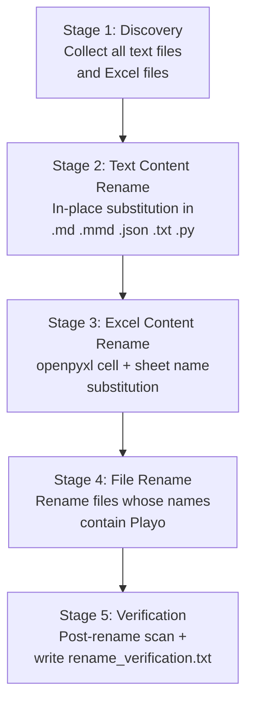

# Design Document: playo-to-game-rename

## Overview

The `playo-to-game-rename` feature is a one-shot Python script (`scripts/rename_playo_to_game.py`) that performs a complete, verified, and idempotent rename of every occurrence of the string `Playo` / `playo` to `Game` / `game` across the `game-ddd` workspace.

The rename covers four distinct surfaces:

| Surface | Mechanism |
|---|---|
| Text file content (`.md`, `.mmd`, `.json`, `.txt`, `.py`) | In-place string substitution |
| File names containing `Playo` | `os.rename` / `Path.rename` |
| Cross-references inside text files pointing to renamed files | Second-pass substitution after file renames |
| Excel workbook cell content and sheet names | `openpyxl` read-modify-write |

After all mutations the script produces a Verification Report at `analysis/rename_verification.txt` that confirms zero remaining references or lists any unresolved occurrences.

### Key Design Decisions

- **Content before rename**: file content (including cross-references) is updated while files still carry their old names, so path strings in content match the pre-rename state. File renames happen last.
- **Idempotency via pre-scan**: before touching any file the script checks whether the file contains any `Playo`/`playo` reference. Files with zero references are skipped entirely.
- **No double-substitution**: the canonical mapping is applied with case-sensitive, non-overlapping replacements. `Game` is never a source pattern, only a target.
- **openpyxl for Excel**: the script uses `openpyxl` (already a dependency of the existing inventory script) to read and rewrite workbook cell strings and sheet names.
- **Single output file**: no intermediate research or scratch files are created; all findings are written to `analysis/rename_verification.txt`.

---

## Architecture

The script is structured as a linear pipeline with five stages:



### Execution Order Rationale

1. **Stage 2 (text content) before Stage 4 (file rename)**: cross-references inside text files are written using the *old* file names. Updating content first means the substitution patterns match the actual paths on disk at the time of writing.
2. **Stage 3 (Excel content) before Stage 4 (file rename)**: Excel files are read from their old paths and saved to their new paths as part of Stage 3 (the save-to-new-path step is the effective rename for Excel files). Stage 4 then skips Excel files that have already been moved.
3. **Stage 5 (verification) last**: scans the final state of all text files for any remaining `Playo`/`playo` occurrences.

---

## Components and Interfaces

### `RenameConfig`

Holds the canonical substitution mapping and workspace root.

```python
@dataclass
class RenameConfig:
    workspace_root: Path
    mapping: list[tuple[str, str]]  # ordered: [("Playo", "Game"), ("playo", "game"), ("PLAYO", "GAME")]
    text_extensions: frozenset[str]  # {".md", ".mmd", ".json", ".txt", ".py"}
    excel_extensions: frozenset[str]  # {".xlsx"}
    verification_report_path: Path
```

The mapping is applied in the listed order. Because `Playo` and `playo` are disjoint strings, order does not affect correctness, but applying the longer/mixed-case variant first is conventional.

### `RenameStats`

Accumulates per-file statistics for the verification report.

```python
@dataclass
class RenameStats:
    files_scanned: int = 0
    files_modified: int = 0
    files_skipped_no_refs: int = 0
    files_skipped_conflict: int = 0
    files_errored: int = 0
    replacements_by_file: dict[str, int] = field(default_factory=dict)
    errors: list[str] = field(default_factory=list)
    conflicts: list[str] = field(default_factory=list)
    remaining_refs: list[tuple[str, int, str]] = field(default_factory=list)
    # (file_path, line_number, line_content)
```

### `TextFileRenamer`

Responsible for Stage 2.

```python
class TextFileRenamer:
    def apply(self, path: Path, config: RenameConfig, stats: RenameStats) -> None:
        """Read file, apply canonical mapping, write back if changed."""
```

- Reads the file in binary mode to detect and preserve line endings.
- Applies substitutions using `str.replace` (not regex) to avoid unintended matches.
- Writes back only if the content changed (idempotency).
- Catches `PermissionError` / `UnicodeDecodeError` and logs to `stats.errors`.

### `ExcelRenamer`

Responsible for Stage 3.

```python
class ExcelRenamer:
    def apply(self, old_path: Path, new_path: Path, config: RenameConfig, stats: RenameStats) -> None:
        """Open workbook, substitute cell strings and sheet names, save to new_path."""
```

- Uses `openpyxl.load_workbook(keep_vba=False)` (write mode, not read-only).
- Iterates all worksheets; for each cell whose `data_type == "s"` (string), applies the canonical mapping.
- Renames sheets whose `.title` contains `Playo`.
- Saves to `new_path`; removes `old_path` only after a successful save.
- Catches `openpyxl` exceptions and logs to `stats.errors` without aborting.

### `FileRenamer`

Responsible for Stage 4.

```python
class FileRenamer:
    def rename(self, old_path: Path, new_path: Path, stats: RenameStats) -> bool:
        """Rename a file; return True on success, False on conflict or error."""
```

- Checks `new_path.exists()` before renaming; logs a conflict warning and returns `False` if the target already exists.
- Skips files that have already been renamed (old path no longer exists).

### `VerificationScanner`

Responsible for Stage 5.

```python
class VerificationScanner:
    def scan(self, config: RenameConfig, stats: RenameStats) -> bool:
        """Scan all text files for remaining references. Returns True if zero found."""
```

- Re-discovers all text files after renames.
- Records `(file_path, line_number, line_content)` for every line containing `Playo` or `playo`.

### `ReportWriter`

Writes `analysis/rename_verification.txt`.

```python
class ReportWriter:
    def write(self, config: RenameConfig, stats: RenameStats, complete: bool) -> None:
```

---

## Data Models

### Canonical Mapping

The substitution table is applied in this fixed order to avoid partial matches:

| Source | Target | Notes |
|---|---|---|
| `Playo` | `Game` | Mixed-case product name |
| `playo` | `game` | Lowercase variant |
| `PLAYO` | `GAME` | All-caps variant (defensive) |

The mapping is **never applied to its own output**: `Game` is not a source pattern, so a file already containing `Game` will not be double-substituted.

### File Discovery

Text files are discovered by walking the workspace root recursively and filtering by extension:

```
text_extensions = {".md", ".mmd", ".json", ".txt", ".py"}
excel_extensions = {".xlsx"}
excluded_dirs = {".git", ".kiro"}
```

The `.git` and `.kiro` directories are excluded to avoid corrupting version-control metadata or spec files.

### Verification Report Format

```
Playo → Game Rename Verification Report
Generated: <ISO-8601 timestamp>
Status: COMPLETE | INCOMPLETE

=== Summary ===
Files scanned:          <n>
Files modified:         <n>
Files skipped (no refs):<n>
Files with errors:      <n>
Total replacements:     <n>

=== Replacements by File ===
<relative_path>: <count> replacement(s)
...

=== Errors ===
<file_path>: <error_reason>
...

=== Conflicts (skipped renames) ===
<old_path> → <new_path>: target already exists
...

=== Remaining References (INCOMPLETE only) ===
<file_path>:<line_number>: <line_content>
...
```

### Excel File Rename Map

The six Excel workbooks and one Markdown file that require renaming:

| Old Name | New Name |
|---|---|
| `Playo_DDD_v6.xlsx` | `Game_DDD_v6.xlsx` |
| `Playo_DDD_v6_1.xlsx` | `Game_DDD_v6_1.xlsx` |
| `Playo_DDD_v6_DomainMap.xlsx` | `Game_DDD_v6_DomainMap.xlsx` |
| `Playo_DDD_v7 (1).xlsx` | `Game_DDD_v7 (1).xlsx` |
| `Playo_DDD_v7.xlsx` | `Game_DDD_v7.xlsx` |
| `Playo_DDD_v8.xlsx` | `Game_DDD_v8.xlsx` |
| `Playo_DDD_v9.xlsx` | `Game_DDD_v9.xlsx` |
| `Playo_DDD_v8_Diagrams.md` | `Game_DDD_v8_Diagrams.md` |

> Note: `Playo_DDD_v9.xlsx` is present in the workspace root and must also be renamed even though it is not explicitly listed in Requirement 2.2 (the requirement covers "all files whose names contain `Playo`" per 2.1).

---

## Correctness Properties

*A property is a characteristic or behavior that should hold true across all valid executions of a system — essentially, a formal statement about what the system should do. Properties serve as the bridge between human-readable specifications and machine-verifiable correctness guarantees.*

