#  DDD v8 — Diagram Set

This file is a **view onto `Playo_DDD_v8.xlsx`**, not a separate model. Every node, edge, state, command, and event in these diagrams traces to an ID in the workbook. If a diagram disagrees with the workbook, the workbook wins — diagrams are regenerable.

## Reading order

1. **#4 Aggregate Lifecycle** — start here for intuition. What does a Game actually become?
2. **#1 Strategic Context Map** — now that you know the pieces, how are they related?
3. **#5 / #6 / #7 Saga sequences** — how does this actually run at request time?
4. **#8 – #11 Statecharts** — what transitions are legal and what guards them?
5. **#12 / #13 / #14 Cross-cutting** — where is the system coupled? Where are the hotspots?

## Conventions used throughout

| Notation | Meaning |
|---|---|
| Solid edge | Write / command call |
| Dashed edge | Read / query |
| Thick edge | Canonical event (Recovery only, per L1) |
| Bold **O / P / T / C** in matrix | Orchestrator / Participant / Trigger / Compensation |
| `EVT-XXX-nnn` | Event ID in workbook |
| `CMD-XXX-nnn` | Command ID in workbook |
| `INV-XXX-nnn` | Invariant ID in workbook |
| `L#` | Locked Decision in 00_Essence |

---

## 1. Strategic Context Map

**Answers:** Where are the bounded contexts, how are they grouped, and how do they depend on each other?
**Sources:** `03_Domain_Classification`, `04_Context_Map`, every BC sheet's `§CONSUMES`.
**What to look for:** Recovery sits at the centre of the deviation flow (all `*DeviationRequested` arrows point in; all canonical `*Cancelled` arrows come out). The four Trust BCs are read-only from decision contexts (dashed edges, per L4).

```mermaid
flowchart TB
    subgraph CORE[CORE]
        COR[Coordination<br/>Game·Session·Booking·Match<br/>BookingGroup·Waitlist·Series·CheckIn]
        REC[Recovery<br/>CancellationCase·NoShowCase<br/>ReplacementCase·DisputeCase<br/>SubsidyLedger]
        MMK[Matchmaking<br/>SkillRating·TeamBalance<br/>StackingFlag]
    end

    subgraph SUPPORTING[SUPPORTING]
        INV[Inventory<br/>TimeSlot·Venue·Court]
        PRC[Pricing<br/>PriceRule·PriceSnapshot<br/>YieldDecision·CommissionRate]
        PRT[Partner Relations<br/>PartnerRelationship·Settlement]
        HOS[Hosting<br/>HostProfile·Capabilities]
        COM[Community<br/>UserProfile·PlayPal·Squad·PeerReview]
        GAM[Gamification<br/>KarmaLedger·Achievement]
        TRN[Training<br/>Coach·Academy·TrainingSession]
    end

    subgraph TRUST[TRUST — 4 profiles, composed at query time only · L4]
        TRS[Trust/Skill]
        TRR[Trust/Reliability]
        TRF[Trust/Financial]
        TRC[Trust/Community]
    end

    subgraph GENERIC[GENERIC]
        IDN[Identity<br/>User·AuthProvider]
        FIN[Financial<br/>Intent·Attempt·Payment·Refund<br/>Wallet·BNPL·Split·Agreement]
    end

    COR -- "CS · SAG-001" --> INV
    COR -- "CS · SAG-001" --> PRC
    COR -- "ACL-Payment · SAG-002" --> FIN
    COR -- "publishes *DeviationRequested" --> REC
    FIN -- "publishes *DeviationRequested" --> REC
    INV -- "VenueUnavailable" --> REC
    HOS -- "HostCancelled" --> REC
    REC == "canonical *Cancelled · L1" ==> COR
    REC -- "IssueRefund · SAG-003" --> FIN
    REC -- "ReleaseTimeSlot" --> INV
    REC -- "Observation events" --> TRS
    REC -- "Observation events" --> TRR
    REC -- "Observation events" --> TRF
    REC -- "CandidatesRanked · SAG-004" --> MMK
    MMK -- "reads ratings" --> REC
    COR -- "MatchCompleted" --> MMK
    COR -- "MatchCompleted" --> TRS
    COR -- "MatchCompleted·CheckIn" --> TRR
    FIN -- "Payment·BNPL events" --> TRF
    COM -- "PeerReviewRevealed" --> TRC
    COM -- "PeerReviewRevealed" --> TRS
    PRT -- "consumes Payment/Refund" --> FIN
    INV -- "partnerId ref" --> PRT
    HOS -- "query capabilities · CF" --> COR
    IDN -- "OHS · IdentityACL" --> COR
    IDN -- "OHS" --> COM
    IDN -- "OHS" --> HOS
    COR -- "MatchCompleted" --> GAM
    COM -- "PeerReviewRevealed" --> GAM
    TRS -. "read at query · L4" .-> COR
    TRR -. "read at query · L4" .-> COR
    TRF -. "read at query · L4" .-> FIN
    TRC -. "read at query · L4" .-> COM

    classDef core fill:#D9534F,stroke:#7A1F1C,color:#fff
    classDef sup fill:#5BC0DE,stroke:#1F5A73,color:#000
    classDef trust fill:#F0AD4E,stroke:#8A5A12,color:#000
    classDef gen fill:#999,stroke:#333,color:#fff
    class COR,REC,MMK core
    class INV,PRC,PRT,HOS,COM,GAM,TRN sup
    class TRS,TRR,TRF,TRC trust
    class IDN,FIN gen
```

---

## 2. Service Blocks — operational grouping

**Answers:** If we staffed this with pods and on-call rotations, how would it cluster?
**Sources:** Proposed grouping; not yet a sheet in the workbook. This is ops-layer, not domain-layer — the Blocks never share aggregates across BCs (L19).

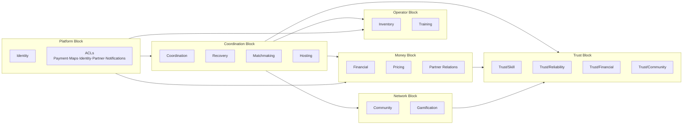

---

## 3. Domain Classification Heatmap

**Answers:** Where should the best engineers and tightest SLOs be?
**Sources:** `03_Domain_Classification` plus judgment on change frequency and on-call pain.

| BC | Class | Differentiation | Change frequency | On-call pain |
|---|---|---|---|---|
| Coordination | CORE | 🔥🔥🔥 | High | High |
| Recovery | CORE | 🔥🔥🔥 | Medium | Highest |
| Matchmaking | CORE | 🔥🔥 | High | Medium |
| Inventory | SUP | 🔥 | Medium | High |
| Pricing | SUP | 🔥🔥 | High | Medium |
| Partner Relations | SUP | 🔥 | Low | Low |
| Hosting | SUP | 🔥 | Low | Low |
| Community | SUP | 🔥 | Medium | Low |
| Gamification | SUP | ❄ | Medium | Low |
| Training | SUP | 🔥 | Low | Low |
| Trust × 4 | SUP | 🔥🔥🔥 | Medium | Low |
| Identity | GEN | ❄ | Low | Medium |
| Financial | GEN | 🔥 | Medium | Highest |

---

## 4. Aggregate Lifecycle — the core narrative

**Answers:** What is the happy path a Game travels? What adjacents exist? Where does Recovery branch in?
**Sources:** `10_BC_Coordination`, `11_BC_Recovery`, all statechart rows.
**What to look for:** Three tracks. The Happy track flows left-to-right. Adjacents (BookingGroup, Waitlist, SessionSeries) sit above. The Deviation track is entirely Recovery-owned — L1 made visual.

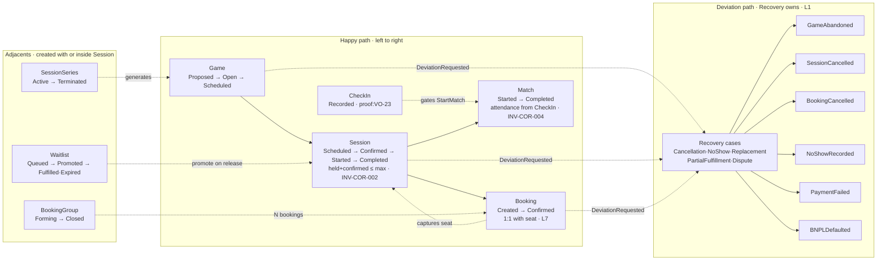

---

## 5. Booking Saga (SAG-002) — full sequence

**Answers:** What happens end-to-end when a user books? How does retry/failover work? What compensates what?
**Sources:** `30_Sagas` SAG-002; `10_BC_Coordination` CMD-COR-005/009/006/010; `15_BC_Financial` CMD-FIN-001..006.
**What to look for:** The Intent/Attempt/Payment split lets retries happen *within* one Intent — the Intent stays Confirmed while Attempts fail and new ones begin against a different PSP.

```mermaid
sequenceDiagram
    autonumber
    actor U as User
    participant COR as Coordination
    participant FIN as Financial
    participant REC as Recovery
    participant PSP as PSP (via PaymentACL)

    U->>COR: CMD-COR-005 HoldSeat(ttl)
    Note over COR: guard: held+confirmed<max<br/>INV-COR-002
    COR-->>U: SeatHeld (TTL set)

    U->>COR: CMD-COR-009 CreateBooking(snapshotId)
    Note over COR: unique(session,user) · INV-COR-006
    COR-->>FIN: BookingCreated

    FIN->>FIN: CMD-FIN-001 CreatePaymentIntent
    FIN->>U: prompt method
    U->>FIN: CMD-FIN-002 ConfirmPaymentIntent(method)
    FIN->>FIN: CMD-FIN-003 BeginPaymentAttempt(psp)
    FIN->>PSP: Authorize

    alt PSP authorizes
        PSP-->>FIN: pgRef
        FIN->>FIN: CMD-FIN-004 AuthorizeAttempt
        FIN->>PSP: Capture
        alt Capture ok
            PSP-->>FIN: capturedAt
            FIN->>FIN: CMD-FIN-005 CaptureAttempt<br/>(Payment created · INV-FIN-003)
            FIN-->>COR: PaymentCaptured
            COR->>COR: CMD-COR-010 MarkBookingConfirmed
            COR->>COR: CMD-COR-006 ConfirmSeat<br/>(held-=1; confirmed+=1)
            COR-->>U: BookingConfirmed
        else Capture fails
            FIN->>FIN: CMD-FIN-006 FailAttempt
            FIN-->>REC: PaymentDeviationRequested
            REC->>REC: OpenCancellationCase
            REC-->>COR: BookingCancelled (canonical · L1)
            COR->>COR: ReleaseSeat (compensation)
        end
    else Authorize fails
        FIN->>FIN: FailAttempt<br/>(Intent stays Confirmed for retry)
        opt retry with different PSP
            FIN->>FIN: BeginPaymentAttempt(psp2)
        end
        alt retries exhausted
            FIN-->>REC: PaymentDeviationRequested
            REC-->>COR: BookingCancelled
            COR->>COR: ReleaseSeat
        end
    end
```

---

## 6. Cancellation Cascade (SAG-003) — full sequence

**Answers:** When a user cancels, what actually happens, and who emits the canonical cancellation?
**Sources:** `30_Sagas` SAG-003; `11_BC_Recovery` CMD-REC-001..003; `15_BC_Financial` CMD-FIN-007.
**What to look for:** Recovery is the *only* emitter of `BookingCancelled` (L1). The Reliability observation is a signal, not a profile write — DisputeCase can reverse it later.

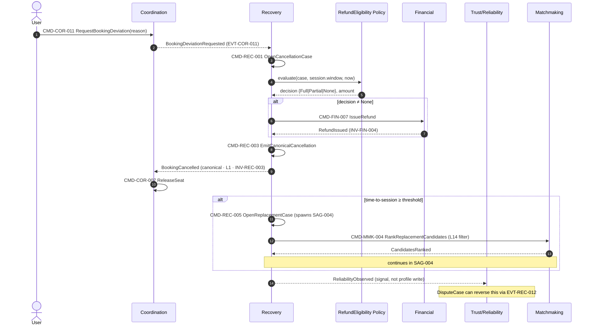

---

## 7. Replacement Search (SAG-004) — full sequence

**Answers:** How does Playo fill a vacated seat automatically? Where does subsidy get recorded?
**Sources:** `30_Sagas` SAG-004; `11_BC_Recovery` CMD-REC-005/006; `24_BC_Matchmaking` CMD-MMK-004; POL-REC-002 (L14), POL-REC-003.
**What to look for:** The SubsidyLedger append is the only place the subsidy decision is persisted — recomputation is a bug.

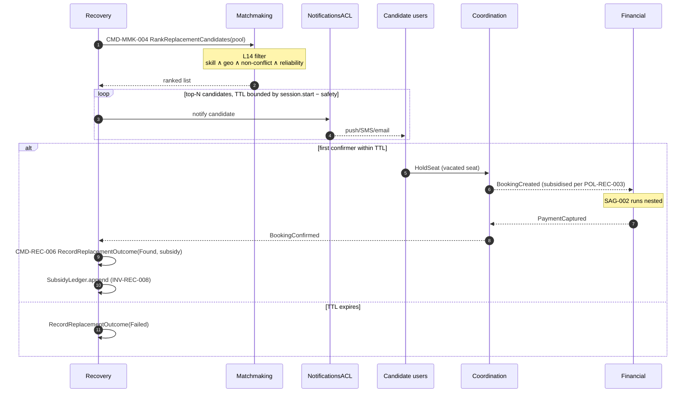

---

## 8. Session statechart (capacity sub-states)

**Answers:** What are the legal Session states, and how do the capacity counters move?
**Sources:** `10_BC_Coordination` §STATECHART rows for Session; INV-COR-002..005.
**What to look for:** `Confirmed` has internal Filling/Full sub-states — the statechart tracks saturation without needing a flag field.

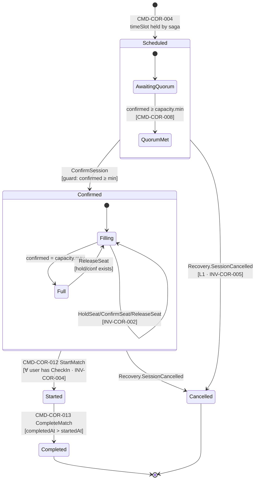

---

## 9. Payment statechart — Intent / Attempt / Payment

**Answers:** What's the retry/failover story? Why does the split earn its keep?
**Sources:** `15_BC_Financial` §STATECHART; INV-FIN-001..003.
**What to look for:** The Intent remains `Confirmed` across Failed Attempts — retry is a new Attempt, not a new Intent. This is why the split matters.

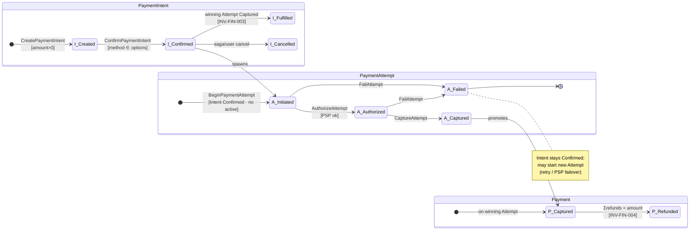

---

## 10. Cancellation & Dispute composite statechart

**Answers:** How does a cancellation actually progress? When does a dispute close?
**Sources:** `11_BC_Recovery` §STATECHART for CancellationCase and DisputeCase; INV-REC-001..007.
**What to look for:** Both machines are guaranteed to close — the Dispute can exit via adjudicator resolution *or* window expiry (defaults to Void). Never stuck.

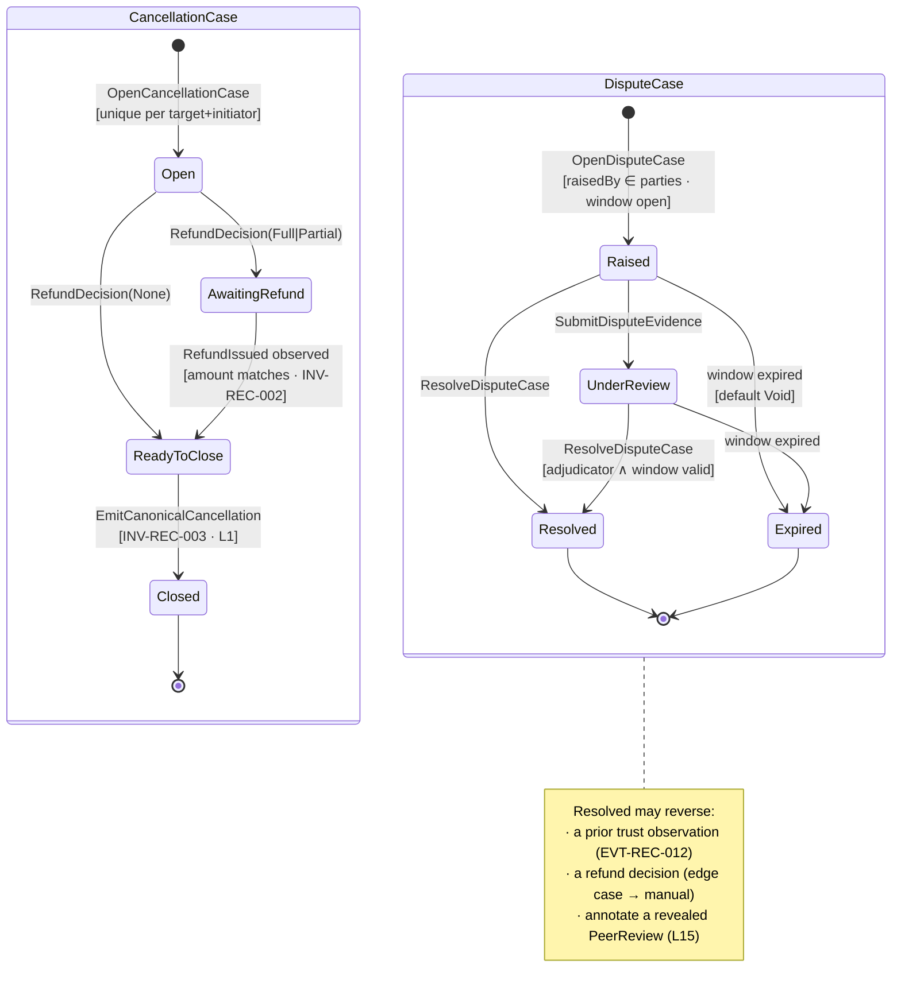

---

## 11. PeerReview statechart — sealing window

**Answers:** How is retaliatory rating blocked? When does a review become visible?
**Sources:** `22_BC_Community` §STATECHART for PeerReview; INV-COM-004, INV-COM-005; L15.
**What to look for:** Content is locked at Seal. Reveal is the earlier of: reciprocal seal, or session end + 14d. Nothing else.

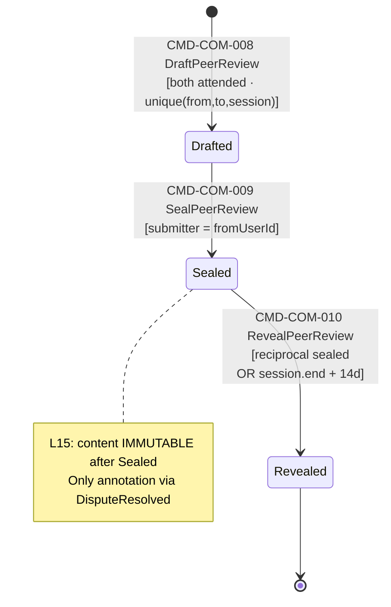

---

## 12. Event flow / ownership graph

**Answers:** Who owns each canonical cross-BC event, and who consumes it?
**Sources:** Every BC sheet's §EVENTS (owner column) and §CONSUMES.
**What to look for:** Thick double-arrows = canonical cancellations, all originating from Recovery. Dashed = DeviationRequested, all terminating at Recovery. The visual shape *is* L1.

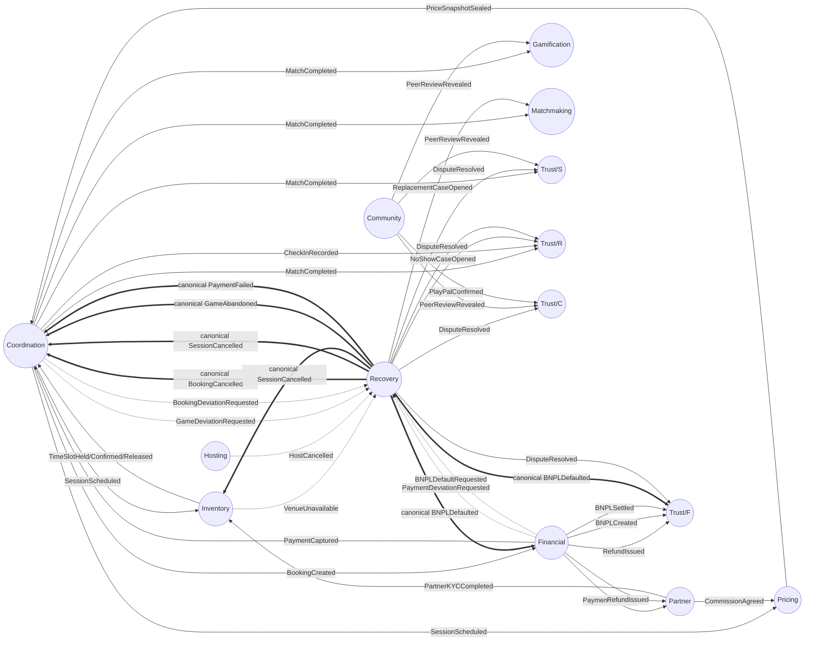

---

## 13. Trust composition fan-in

**Answers:** How can there be four profiles but no composed score? Where does a trust decision actually live?
**Sources:** Trust BC `§CONSUMES` whitelists in sheets 16–19; Trust Composition Policy POL-COR-002; L4.
**What to look for:** Profiles accumulate from events. The Policy reads them per use case, returns a decision, and stores nothing. Different use cases pick different subsets of profiles.

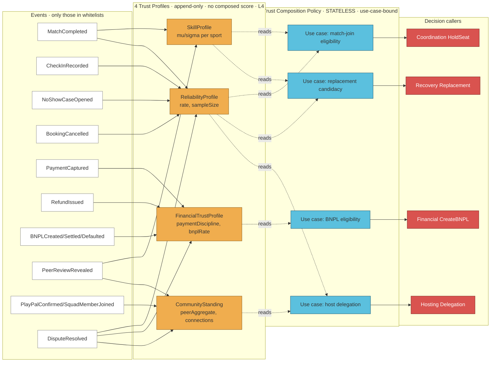

---

## 14. Saga × BC coupling matrix

**Answers:** Which BCs are most coupled? Which sagas cross the most boundaries? Where is Recovery actually the orchestrator?
**Sources:** `30_Sagas` Orchestrator column.

| Saga | COR | REC | FIN | INV | PRC | MMK | HOS | TRR | TRS | TRF | COM | GAM |
|---|---|---|---|---|---|---|---|---|---|---|---|---|
| **SAG-001 Game-to-Session** | **O** | · | · | P | P | · | · | · | · | · | · | · |
| **SAG-002 Booking** | **O** | C | P | · | · | · | · | · | · | · | · | · |
| **SAG-003 Player Cancel** | C | **O** | P | · | · | · | · | obs | · | · | · | · |
| **SAG-004 Replacement** | P | **O** | P | · | · | P | · | · | · | · | · | · |
| **SAG-005 Host Cancel** | C | **O** | P | P | · | · | T | obs | · | · | · | · |
| **SAG-006 Venue Cancel** | C | **O** | P | T | · | · | · | · | · | · | · | · |
| **SAG-007 Gamification** | T | · | · | · | · | · | · | · | · | · | T | **O (chor)** |
| **SAG-008 Yield/Subsidy** | · | · | · | · | **O** | · | · | · | · | · | · | · |
| **SAG-009 Community→Trust** | · | · | · | · | · | · | · | · | · | · | **O (chor)** | · |
| **SAG-010 BNPL Default** | C | **O** | T | · | · | · | · | · | · | obs | · | · |
| **SAG-011 Waitlist Promote** | **O** | · | P | · | · | · | · | · | · | · | · | · |
| **SAG-012 Series Occurrence** | **O** | · | · | P | P | · | · | · | · | · | · | · |
| **SAG-013 Dispute** | · | **O** | P\* | · | · | · | · | rev | rev | rev | rev | · |

**Legend:** **O** = Orchestrator · P = Participant (command call) · T = Trigger source · C = Compensation target · obs = observation emitted · rev = observation reversal possible · P\* = manual-escalate edge · chor = choreographed.

**Visible hotspots:**
- **Recovery orchestrates 6 of 13 sagas** and participates in most of the rest.
- **Financial** is a participant in nearly every money-critical saga but orchestrates none (by design — it owns state, not choreography).
- **Trust BCs never orchestrate**, only observe or reverse. This is L4 made visual.
- The **Core block (COR + REC + MMK)** touches every other BC except Training. Training is the most loosely coupled.

---

## How to keep these in sync with the workbook

- The workbook is the source of truth. These diagrams are a *view*.
- When a BC sheet changes, the relevant diagram is stale. Re-render from the workbook, don't edit in place.
- If a diagram shows an edge that isn't in any `§CONSUMES` or `§COMMANDS.calls` row, the workbook is the authority — delete the edge from the diagram.
- When adding a new BC, the Strategic Context Map, the Event Flow, and the Saga Matrix are the three that must be updated first. Statecharts only need to be added when the aggregate has branching behaviour worth showing.
