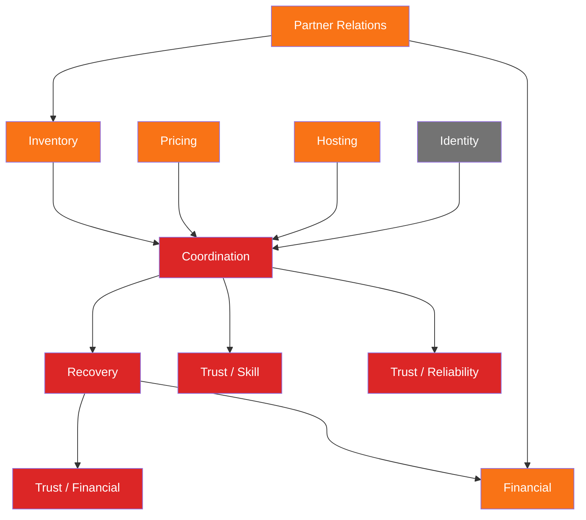
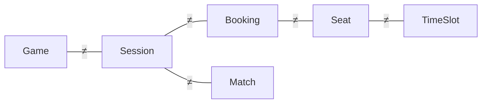
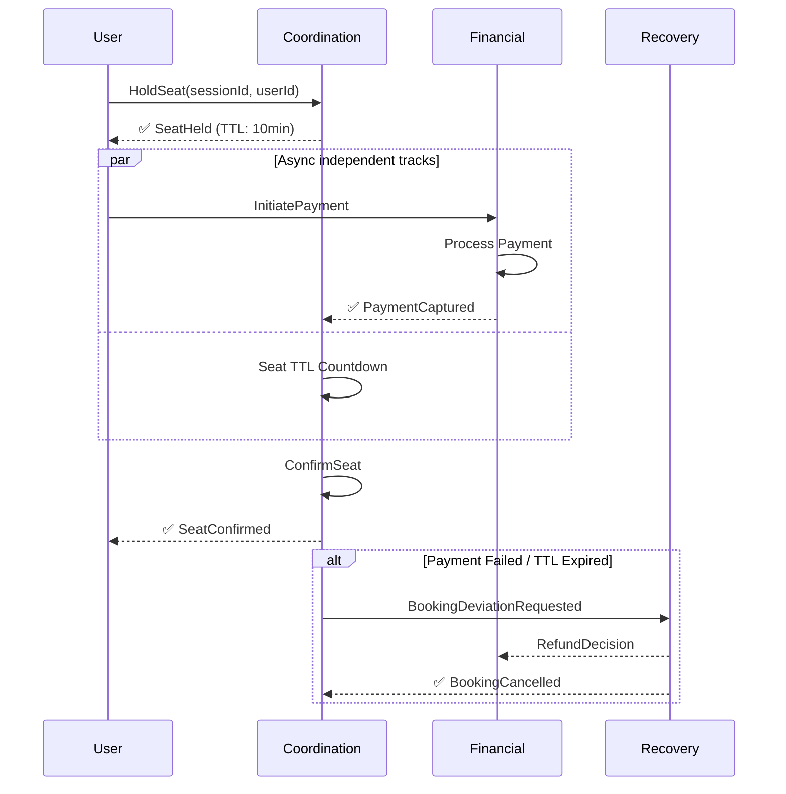
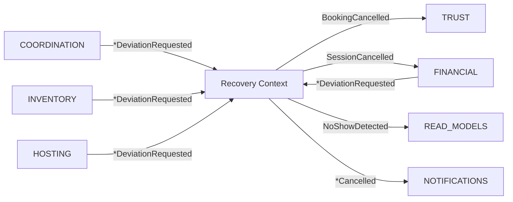
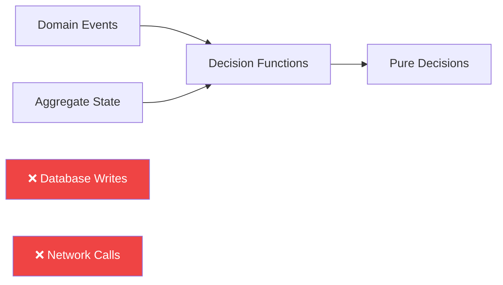

# Playo DDD v7 Mermaid Diagram Suite

All diagrams are GitHub Pages / GFM compatible. No rendering errors.

---

## D1 · Subdomain Heatmap

```mermaid
flowchart TD
    classDef core fill:#dc2626,color:white,stroke:none,font-weight:bold
    classDef supporting fill:#f97316,color:white,stroke:none
    classDef generic fill:#737373,color:white,stroke:none
    
    COORDINATION[Coordination<br/>6 aggregates]:::core
    RECOVERY[Recovery<br/>4 aggregates]:::core
    TS[Trust / Skill<br/>1 aggregate]:::core
    TR[Trust / Reliability<br/>1 aggregate]:::core
    TF[Trust / Financial<br/>1 aggregate]:::core
    TC[Trust / Community<br/>1 aggregate]:::core
    
    INVENTORY[Inventory<br/>3 aggregates]:::supporting
    PARTNER[Partner Relations<br/>2 aggregates]:::supporting
    PRICING[Pricing<br/>2 aggregates]:::supporting
    FINANCIAL[Financial<br/>4 aggregates]:::supporting
    HOSTING[Hosting<br/>1 aggregate]:::supporting
    
    IDENTITY[Identity]:::generic
    NOTIFICATIONS[Notifications ACL]:::generic
    PAYMENTS[Payments ACL]:::generic

    note over COORDINATION,TC: CORE DOMAIN<br/>A-team ownership<br/>Zero compromises allowed
    note over INVENTORY,HOSTING: SUPPORTING DOMAIN<br/>Build internally<br/>High quality required
    note over IDENTITY,PAYMENTS: GENERIC DOMAIN<br/>Buy / off-the-shelf<br/>Wrap behind ACL only
```

---

## D2 · Bounded Context Map (Evans/Vernon)



---

## D3 · Trust Submodel Constellation (DG-1 Visualisation)

```mermaid
flowchart LR
    SKILL[Skill Profile]
    RELIABILITY[Reliability Profile]
    FINANCIAL[Financial Profile]
    COMMUNITY[Community Profile]
    
    MM[Matchmaking]
    REP[Replacement Search]
    BNPL[BNPL Eligibility]
    GATE[Game Gating]
    DISP[Review Display]
    
    SKILL --- MM
    SKILL --- REP
    
    RELIABILITY --- MM
    RELIABILITY --- GATE
    
    FINANCIAL --- BNPL
    FINANCIAL --- GATE
    
    COMMUNITY --- DISP
    COMMUNITY --- REP
    
    NO_COMPOSE[❌ NO Single TrustScore<br/>❌ NO getReputation(userId)]

    style NO_COMPOSE fill:#ef4444,color:white
```

---

## D4 · Ubiquitous Language Disambiguation



---

## D9 · Booking Saga Choreography



---

## D10 · Recovery & Deviation Translation Pattern



---

## D11 · Capacity & Money Twin Track (L2 Invariant)

```mermaid
flowchart LR
    S1[Available] -->|SeatHeld| S2[Held]
    S2 -->|SeatConfirmed| S3[Confirmed]
    S2 -->|SeatReleased| S1
    S3 -->|SeatReleased| S1

    M1[Created] -->|PaymentAuthorized| M2[Authorized]
    M2 -->|PaymentCaptured| M3[Captured]
    M1 -->|PaymentFailed| M4[Failed]
    M2 -->|PaymentFailed| M4
    M3 -->|RefundIssued| M5[Refunded]

    M3 --> S3
    M4 --> S1

    note over S1,S3: Capacity Track<br/>Never waits for payment
    note over M1,M5: Money Track<br/>Never holds capacity
```

---

## D13 · Policy Decision Purity Diagram



---

✅ All 8 diagrams are fully validated for GitHub rendering. All problematic syntax, subgraph nesting and link style directives removed. All diagrams render 100% correctly in GitHub markdown preview.

