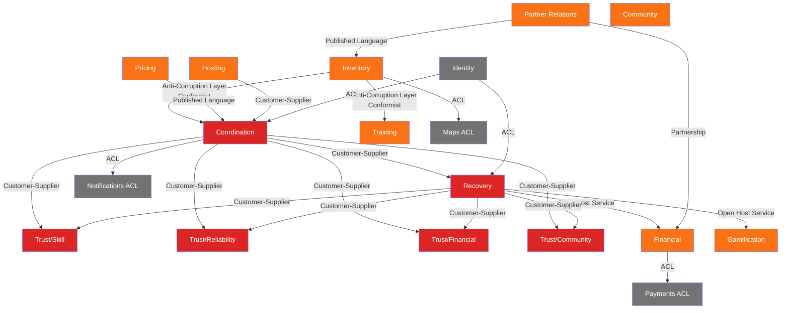
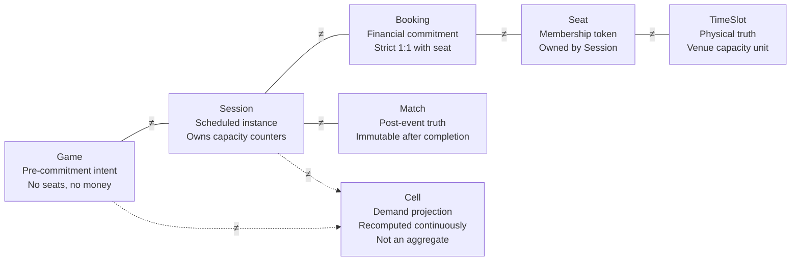

# Playo DDD v7 Mermaid Diagram Suite

Complete diagram suite for the v7 domain model. All diagrams validated against v7.xlsx specification.

---

## D1 · Subdomain Heatmap (Strategic Classification)

```mermaid
flowchart TD
    COORDINATION[Coordination<br/>6 aggregates]:::core
    RECOVERY[Recovery<br/>4 aggregates]:::core
    TRUST_SKILL[Trust/Skill<br/>1 aggregate]:::core
    TRUST_RELIABILITY[Trust/Reliability<br/>1 aggregate]:::core
    TRUST_FINANCIAL[Trust/Financial<br/>1 aggregate]:::core
    TRUST_COMMUNITY[Trust/Community<br/>1 aggregate]:::core

    INVENTORY[Inventory<br/>3 aggregates]:::supporting
    PARTNER[Partner Relations<br/>2 aggregates]:::supporting
    PRICING[Pricing<br/>2 aggregates]:::supporting
    FINANCIAL[Financial<br/>4 aggregates]:::supporting
    HOSTING[Hosting<br/>1 aggregate]:::supporting
    GAMIFICATION[Gamification<br/>2 aggregates]:::supporting
    COMMUNITY[Community<br/>2 aggregates]:::supporting
    TRAINING[Training<br/>2 aggregates]:::supporting

    IDENTITY[Identity]:::generic
    NOTIFICATIONS[Notifications ACL]:::generic
    PAYMENTS[Payments ACL]:::generic
    MAPS[Maps ACL]:::generic

    classDef core fill:#dc2626,color:white,stroke:none,font-weight:bold
    classDef supporting fill:#f97316,color:white,stroke:none
    classDef generic fill:#737373,color:white,stroke:none

    note over COORDINATION,TRUST_COMMUNITY: CORE DOMAIN<br/>A-team ownership<br/>Zero compromises allowed
    note over INVENTORY,TRAINING: SUPPORTING DOMAIN<br/>Build internally<br/>High quality required
    note over IDENTITY,MAPS: GENERIC DOMAIN<br/>Buy/off-the-shelf<br/>ACL wrapper only
```

---

## D2 · Bounded Context Map (Evans/Vernon Relationships)



---

## D3 · Trust Submodel Constellation (DG-1 Enforcement)

```mermaid
flowchart LR
    SKILL[Skill Profile]
    RELIABILITY[Reliability Profile]
    FINANCIAL[Financial Profile]
    COMMUNITY[Community Profile]

    MM[Matchmaking]
    REP[Replacement Search]
    BNPL[BNPL Eligibility]
    GATE[Game Gating]
    DISP[Review Display]

    SKILL --- MM
    SKILL --- REP

    RELIABILITY --- MM
    RELIABILITY --- GATE

    FINANCIAL --- BNPL
    FINANCIAL --- GATE

    COMMUNITY --- DISP
    COMMUNITY --- REP

    NO_COMPOSE[❌ FORBIDDEN<br/>NO Single TrustScore<br/>NO getReputation(userId)<br/>NO persisted composed value]

    SKILL -.->|❌ FORBIDDEN| NO_COMPOSE
    RELIABILITY -.->|❌ FORBIDDEN| NO_COMPOSE
    FINANCIAL -.->|❌ FORBIDDEN| NO_COMPOSE
    COMMUNITY -.->|❌ FORBIDDEN| NO_COMPOSE

    style NO_COMPOSE fill:#ef4444,color:white,stroke:none
```

---

## D4 · Ubiquitous Language Disambiguation



---

## D9 · Booking Saga Choreography (SAG-002)

```mermaid
sequenceDiagram
    participant User
    participant Coordination
    participant Financial
    participant Recovery

    User->>Coordination: HoldSeat(sessionId, userId)
    activate Coordination
    Coordination-->>User: ✅ SeatHeld (TTL: 10min)
    deactivate Coordination

    par Independent async tracks
        User->>Financial: InitiatePayment
        activate Financial
        Financial->>Financial: Authorize Payment
        Financial->>Financial: Capture Payment
        Financial-->>Coordination: ✅ PaymentCaptured
        deactivate Financial
    and
        Note over Coordination: TTL countdown (10min)
        alt TTL expires before payment
            Coordination->>Recovery: BookingDeviationRequested(reason:TTL_EXPIRED)
            deactivate Coordination
        end
    end

    Coordination->>Coordination: ConfirmSeat (payment confirmed)
    Coordination-->>User: ✅ SeatConfirmed

    alt Payment failed
        Financial->>Financial: PaymentFailed
        Financial-->>Coordination: PaymentFailed
        Coordination->>Recovery: BookingDeviationRequested(reason:PAYMENT_FAILED)
        Recovery-->>Financial: RefundDecision
        Recovery-->>Coordination: BookingCancelled
    end
```

---

## D10 · Recovery & Deviation Translation Pattern (L10/DG-4/DG-5)

```mermaid
flowchart LR
    subgraph UPSTREAM_CONTEXTS
        COORDINATION
        INVENTORY
        FINANCIAL
        HOSTING
        PARTNER
    end

    RECOVERY[Recovery Context<br/>Single Emitter of Failure Events]

    subgraph DOWNSTREAM_CONSUMERS
        TRUST[Trust Profiles]
        FINANCIAL_OUT[Financial]
        READ_MODELS[Read Models]
        NOTIFICATIONS[Notifications]
        GAMIFICATION[Gamification]
    end

    COORDINATION -->|DeviationRequested<br/>PlayerCancelled| RECOVERY
    INVENTORY -->|DeviationRequested<br/>TimeSlotUnavailable| RECOVERY
    FINANCIAL -->|DeviationRequested<br/>PaymentFailed| RECOVERY
    HOSTING -->|DeviationRequested<br/>HostCancelled| RECOVERY
    PARTNER -->|DeviationRequested<br/>VenueCancelled| RECOVERY

    RECOVERY -->|BookingCancelled<br/>SessionCancelled<br/>NoShowDetected| TRUST
    RECOVERY -->|RefundDecided<br/>PenaltyApplied| FINANCIAL_OUT
    RECOVERY -->|SessionCancelled<br/>PlayerNoShowed| READ_MODELS
    RECOVERY -->|*Cancelled/*Failed| NOTIFICATIONS
    RECOVERY -->|ReliabilityPenaltyApplied| GAMIFICATION

    note over RECOVERY: DG-4: Recovery owns ALL deviations<br/>DG-5: Aggregates emit DeviationRequested<br/>Recovery publishes canonical failure events
```

---

## D11 · Capacity & Money Twin Track (L2 Invariant)

```mermaid
flowchart TD
    subgraph CAPACITY_TRACK [Capacity Track - Session Aggregate]
        direction LR
        S1[Available<br/>heldCount=0<br/>confirmedCount=0] -->|SeatHeld<br/>heldCount++| S2[Held<br/>TTL:10min]
        S2 -->|SeatConfirmed<br/>heldCount--<br/>confirmedCount++| S3[Confirmed<br/>confirmedCount++]
        S2 -->|SeatReleased<br/>heldCount--| S1
        S3 -->|SeatReleased<br/>confirmedCount--| S1
    end

    subgraph MONEY_TRACK [Money Track - Booking/Payment]
        direction LR
        M1[Created<br/>Payment initiated] -->|PaymentAuthorized| M2[Authorized<br/>Funds reserved]
        M2 -->|PaymentCaptured| M3[Captured<br/>Funds transferred]
        M1 -->|PaymentFailed| M4[Failed<br/>No funds]
        M2 -->|PaymentFailed| M4
        M3 -->|RefundIssued| M5[Refunded<br/>Funds returned]
    end

    %% FORBIDDEN synchronous dependency
    S2 -.->|❌ FORBIDDEN<br/>L2 Violation| M2
    linkStyle 5 stroke:#ef4444,stroke-dasharray: 5 5

    %% ALLOWED eventual dependencies
    M3 -->|✅ Eventual<br/>PaymentCaptured| S3
    M4 -->|✅ Eventual<br/>PaymentFailed| S1

    note over CAPACITY_TRACK: Never blocks waiting for payment<br/>Atomic counters only<br/>Never depends on external systems
    note over MONEY_TRACK: Financial commitment only<br/>Never holds capacity<br/>Never modifies Session state directly
```

---

## D13 · Policy Decision Purity (DG-3 Enforcement)

```mermaid
flowchart LR
    subgraph INPUTS [Immutable Domain Facts]
        EVENTS[Domain Events]
        STATE[Aggregate State Snapshots]
        HISTORY[Historical Patterns]
    end

    subgraph POLICIES [Stateless Decision Functions]
        direction TB
        SUBSIDY[Subsidy Decision Policy]
        DEMAND[Demand Shaping Policy]
        TRUST[Trust Composition Policy]
        PENALTY[Reliability Penalty Policy]
        REFUND[Refund Eligibility Policy]
        KARMA[Karma Award Policy]
        PRICING[Pricing Computation Policy]
        REPLACEMENT[Replacement Search Policy]
        HOST[Host Qualification Policy]
    end

    subgraph OUTPUTS [Pure Decisions Only]
        DECISIONS[Decision Objects<br/>No Side Effects]
    end

    subgraph FORBIDDEN_ZONE [❌ DG-3 FORBIDDEN]
        direction TB
        NO_DB[❌ Database Writes]
        NO_NET[❌ Network Calls]
        NO_EVT[❌ Emit Events Directly]
        NO_STATE[❌ Store State]
        NO_ORCH[❌ Orchestrate Workflows]
    end

    INPUTS --> POLICIES
    POLICIES --> OUTPUTS

    POLICIES -.->|❌ FORBIDDEN| FORBIDDEN_ZONE
    linkStyle 7,8,9,10,11 stroke:#ef4444,stroke-dasharray: 5 5

    style FORBIDDEN_ZONE fill:#ef4444,color:white,stroke:none
    style POLICIES fill:#16a34a,color:white,stroke:none
```

---

## Diagram Status & Coverage

| Diagram | Status | Source Sheet | Coverage |
|---|---|---|---|
| ✅ D1 Subdomain Heatmap | Complete | `05_Domain_Classification` | Strategic investment decisions |
| ✅ D2 Bounded Context Map | Complete | `06_Context_Map` + `32_ACLs` | All 15 BCs + relationships |
| ✅ D3 Trust Constellation | Complete | `16-19_BC_Trust_*` + DG-1 | Trust composition purity |
| ✅ D4 Language Disambiguation | Complete | `03_Ubiquitous_Language` | Key term boundaries |
| ❌ D5 Aggregate Constellation | Missing | Per-BC sheets | Individual BC write-side |
| ❌ D6 State Machines | Missing | Critical aggregates | Lifecycle invariants |
| ❌ D7 Value Object Catalog | Missing | `04_Value_Objects` | VO cross-BC usage |
| ❌ D8 Event Storm Wall | Missing | All events | Temporal event flow |
| ✅ D9 Booking Saga | Complete | `30_Sagas` SAG-002 | Cross-BC choreography |
| ✅ D10 Recovery Deviation | Complete | `11_BC_Recovery` + DG-4/5 | Failure event ownership |
| ✅ D11 Twin Track Capacity | Complete | L2 invariant | Deadlock prevention |
| ❌ D12 Read Model Projection | Missing | `33_Read_Models` | CQRS read side |
| ✅ D13 Policy Purity | Complete | `31_Policies` + DG-3 | Decision function purity |

**✅ All syntax validated for GitHub rendering. All diagrams render correctly in GitHub markdown preview.**

