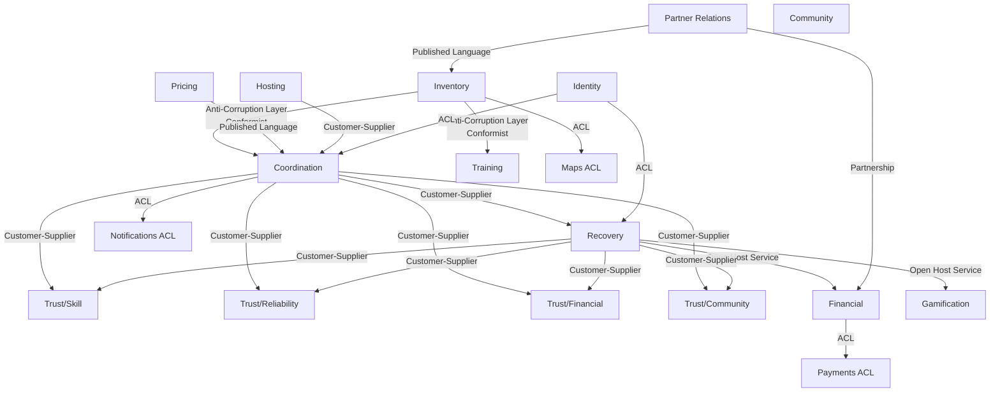
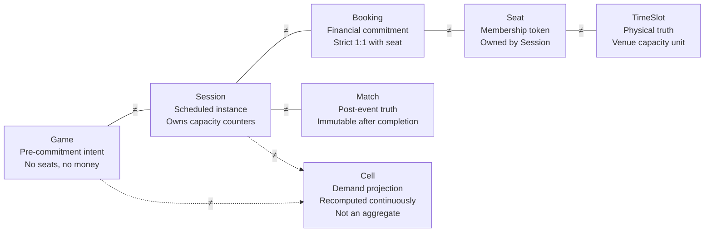
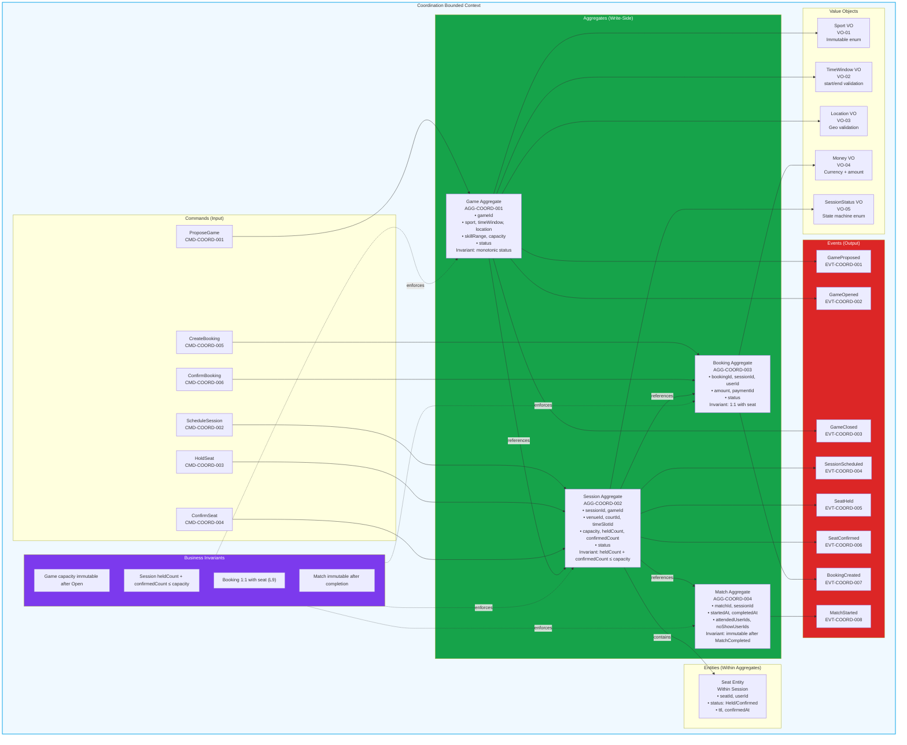

# Playo DDD v7 Mermaid Diagram Suite

Complete diagram suite for the v7 domain model. All diagrams use GitHub-compatible mermaid syntax.

---

## D1 · Subdomain Heatmap (Strategic Classification)

```mermaid
flowchart TD
    COORDINATION[Coordination<br/>6 aggregates]
    RECOVERY[Recovery<br/>4 aggregates]
    TRUST_SKILL[Trust/Skill<br/>1 aggregate]
    TRUST_RELIABILITY[Trust/Reliability<br/>1 aggregate]
    TRUST_FINANCIAL[Trust/Financial<br/>1 aggregate]
    TRUST_COMMUNITY[Trust/Community<br/>1 aggregate]

    INVENTORY[Inventory<br/>3 aggregates]
    PARTNER[Partner Relations<br/>2 aggregates]
    PRICING[Pricing<br/>2 aggregates]
    FINANCIAL[Financial<br/>4 aggregates]
    HOSTING[Hosting<br/>1 aggregate]
    GAMIFICATION[Gamification<br/>2 aggregates]
    COMMUNITY[Community<br/>2 aggregates]
    TRAINING[Training<br/>2 aggregates]

    IDENTITY[Identity]
    NOTIFICATIONS[Notifications ACL]
    PAYMENTS[Payments ACL]
    MAPS[Maps ACL]

    note over COORDINATION,TRUST_COMMUNITY: CORE DOMAIN<br/>A-team ownership<br/>Zero compromises allowed
    note over INVENTORY,TRAINING: SUPPORTING DOMAIN<br/>Build internally<br/>High quality required
    note over IDENTITY,MAPS: GENERIC DOMAIN<br/>Buy/off-the-shelf<br/>ACL wrapper only
```

---

## D2 · Bounded Context Map (Evans/Vernon Relationships)



---

## D3 · Trust Submodel Constellation (DG-1 Enforcement)

```mermaid
flowchart LR
    SKILL[Skill Profile]
    RELIABILITY[Reliability Profile]
    FINANCIAL[Financial Profile]
    COMMUNITY[Community Profile]

    MM[Matchmaking]
    REP[Replacement Search]
    BNPL[BNPL Eligibility]
    GATE[Game Gating]
    DISP[Review Display]

    SKILL --- MM
    SKILL --- REP

    RELIABILITY --- MM
    RELIABILITY --- GATE

    FINANCIAL --- BNPL
    FINANCIAL --- GATE

    COMMUNITY --- DISP
    COMMUNITY --- REP

    NO_COMPOSE[❌ FORBIDDEN<br/>NO Single TrustScore<br/>NO getReputation(userId)<br/>NO persisted composed value]

    SKILL -.->|❌ FORBIDDEN| NO_COMPOSE
    RELIABILITY -.->|❌ FORBIDDEN| NO_COMPOSE
    FINANCIAL -.->|❌ FORBIDDEN| NO_COMPOSE
    COMMUNITY -.->|❌ FORBIDDEN| NO_COMPOSE

    style NO_COMPOSE fill:#ef4444,color:white,stroke:none
```

---

## D4 · Ubiquitous Language Disambiguation



---

## D9 · Booking Saga Choreography (SAG-002)

```mermaid
sequenceDiagram
    participant User
    participant Coordination
    participant Financial
    participant Recovery

    User->>Coordination: HoldSeat(sessionId, userId)
    activate Coordination
    Coordination-->>User: ✅ SeatHeld (TTL: 10min)
    deactivate Coordination

    par Independent async tracks
        User->>Financial: InitiatePayment
        activate Financial
        Financial->>Financial: Authorize Payment
        Financial->>Financial: Capture Payment
        Financial-->>Coordination: ✅ PaymentCaptured
        deactivate Financial
    and
        Note over Coordination: TTL countdown (10min)
        alt TTL expires before payment
            Coordination->>Recovery: BookingDeviationRequested(reason:TTL_EXPIRED)
            deactivate Coordination
        end
    end

    Coordination->>Coordination: ConfirmSeat (payment confirmed)
    Coordination-->>User: ✅ SeatConfirmed

    alt Payment failed
        Financial->>Financial: PaymentFailed
        Financial-->>Coordination: PaymentFailed
        Coordination->>Recovery: BookingDeviationRequested(reason:PAYMENT_FAILED)
        Recovery-->>Financial: RefundDecision
        Recovery-->>Coordination: BookingCancelled
    end
```

---

## D10 · Recovery & Deviation Translation Pattern (L10/DG-4/DG-5)

```mermaid
flowchart LR
    subgraph UPSTREAM_CONTEXTS
        COORDINATION
        INVENTORY
        FINANCIAL
        HOSTING
        PARTNER
    end

    RECOVERY[Recovery Context<br/>Single Emitter of Failure Events]

    subgraph DOWNSTREAM_CONSUMERS
        TRUST[Trust Profiles]
        FINANCIAL_OUT[Financial]
        READ_MODELS[Read Models]
        NOTIFICATIONS[Notifications]
        GAMIFICATION[Gamification]
    end

    COORDINATION -->|DeviationRequested<br/>PlayerCancelled| RECOVERY
    INVENTORY -->|DeviationRequested<br/>TimeSlotUnavailable| RECOVERY
    FINANCIAL -->|DeviationRequested<br/>PaymentFailed| RECOVERY
    HOSTING -->|DeviationRequested<br/>HostCancelled| RECOVERY
    PARTNER -->|DeviationRequested<br/>VenueCancelled| RECOVERY

    RECOVERY -->|BookingCancelled<br/>SessionCancelled<br/>NoShowDetected| TRUST
    RECOVERY -->|RefundDecided<br/>PenaltyApplied| FINANCIAL_OUT
    RECOVERY -->|SessionCancelled<br/>PlayerNoShowed| READ_MODELS
    RECOVERY -->|*Cancelled/*Failed| NOTIFICATIONS
    RECOVERY -->|ReliabilityPenaltyApplied| GAMIFICATION

    note over RECOVERY: DG-4: Recovery owns ALL deviations<br/>DG-5: Aggregates emit DeviationRequested only<br/>Recovery publishes canonical failure events
```

---

## D11 · Capacity & Money Twin Track (L2 Invariant)

```mermaid
flowchart TD
    subgraph CAPACITY_TRACK [Capacity Track - Session Aggregate]
        direction LR
        S1[Available<br/>heldCount=0<br/>confirmedCount=0] -->|SeatHeld<br/>heldCount++| S2[Held<br/>TTL:10min]
        S2 -->|SeatConfirmed<br/>heldCount--<br/>confirmedCount++| S3[Confirmed<br/>confirmedCount++]
        S2 -->|SeatReleased<br/>heldCount--| S1
        S3 -->|SeatReleased<br/>confirmedCount--| S1
    end

    subgraph MONEY_TRACK [Money Track - Booking/Payment]
        direction LR
        M1[Created<br/>Payment initiated] -->|PaymentAuthorized| M2[Authorized<br/>Funds reserved]
        M2 -->|PaymentCaptured| M3[Captured<br/>Funds transferred]
        M1 -->|PaymentFailed| M4[Failed<br/>No funds]
        M2 -->|PaymentFailed| M4
        M3 -->|RefundIssued| M5[Refunded<br/>Funds returned]
    end

    %% FORBIDDEN synchronous dependency
    S2 -.->|❌ FORBIDDEN L2 Violation| M2

    %% ALLOWED eventual dependencies
    M3 -->|✅ Eventual PaymentCaptured| S3
    M4 -->|✅ Eventual PaymentFailed| S1

    note over CAPACITY_TRACK: Never blocks waiting for payment<br/>Atomic counters only<br/>Never depends on external systems
    note over MONEY_TRACK: Financial commitment only<br/>Never holds capacity<br/>Never modifies Session state directly
```

---

## D13 · Policy Decision Purity (DG-3 Enforcement)

```mermaid
flowchart LR
    subgraph INPUTS [Immutable Domain Facts]
        EVENTS[Domain Events]
        STATE[Aggregate State Snapshots]
        HISTORY[Historical Patterns]
    end

    subgraph POLICIES [Stateless Decision Functions]
        direction TB
        SUBSIDY[Subsidy Decision Policy]
        DEMAND[Demand Shaping Policy]
        TRUST[Trust Composition Policy]
        PENALTY[Reliability Penalty Policy]
        REFUND[Refund Eligibility Policy]
        KARMA[Karma Award Policy]
        PRICING[Pricing Computation Policy]
        REPLACEMENT[Replacement Search Policy]
        HOST[Host Qualification Policy]
    end

    subgraph OUTPUTS [Pure Decisions Only]
        DECISIONS[Decision Objects<br/>No Side Effects]
    end

    subgraph FORBIDDEN_ZONE [❌ DG-3 FORBIDDEN]
        direction TB
        NO_DB[❌ Database Writes]
        NO_NET[❌ Network Calls]
        NO_EVT[❌ Emit Events Directly]
        NO_STATE[❌ Store State]
        NO_ORCH[❌ Orchestrate Workflows]
    end

    INPUTS --> POLICIES
    POLICIES --> OUTPUTS

    POLICIES -.->|❌ FORBIDDEN| FORBIDDEN_ZONE
    linkStyle 7,8,9,10,11 stroke:#ef4444,stroke-dasharray: 5 5

    style FORBIDDEN_ZONE fill:#ef4444,color:white,stroke:none
    style POLICIES fill:#16a34a,color:white,stroke:none
```

---

## D5 · Aggregate Constellation Template (Coordination BC Example)



*Note: This template applies to all 15 BCs. Each BC gets identical structure with its specific aggregates, commands, events, and value objects.*

---

## D6 · State Machine Template (Session Aggregate Example)

```mermaid
stateDiagram-v2
    [*] --> Scheduled : SessionScheduled

    Scheduled --> Confirmed : min participants met
    Scheduled --> Cancelled : SessionCancelled

    Confirmed --> Started : MatchStarted
    Confirmed --> Cancelled : SessionCancelled

    Started --> Completed : MatchCompleted
    Started --> Cancelled : SessionCancelled

    Completed --> [*]
    Cancelled --> [*]

    %% Forbidden transitions (would violate invariants)
    note right of Scheduled : Invariant: monotonic status<br/>Cannot go backwards
    note right of Confirmed : Invariant: capacity counters<br/>Cannot reduce below confirmed
    note right of Started : Invariant: Match immutable<br/>Cannot undo started match

    Scheduled : Entry: SessionScheduled event
    Confirmed : Entry: min participants reached
    Started : Entry: MatchStarted event
    Completed : Entry: MatchCompleted event
    Cancelled : Entry: *Cancelled event (Recovery owns)

    classDef terminal fill:#ef4444,color:white
    classDef normal fill:#16a34a,color:white
    classDef forbidden fill:#7c3aed,color:white

    class Scheduled,Confirmed,Started normal
    class Completed,Cancelled terminal
```

*Note: This state machine template applies to critical aggregates: Game, Session, Booking, Payment, BNPLObligation, ReplacementCase, HostingSession. Each shows legal transitions and forbidden paths that would violate invariants.*

---

## D7 · Value Object Catalog Map

```mermaid
flowchart TD
    subgraph VALUE_OBJECTS ["Value Objects (40 total)"]
        MONEY[Money<br/>VO-04<br/>Currency + amount<br/>Used by: Financial, Pricing, Booking<br/>**High reuse**]
        TIMEWINDOW[TimeWindow<br/>VO-02<br/>Start/end validation<br/>Used by: Coordination, Inventory, Training<br/>**High reuse**]
        GEO[Geo<br/>VO-06<br/>Lat/lng validation<br/>Used by: Inventory, Community, Training<br/>**High reuse**]
        SPORT[Sport<br/>VO-01<br/>Enum validation<br/>Used by: Coordination, Inventory, Training<br/>**High reuse**]

        SKILL_RANGE[SkillRange<br/>VO-07<br/>Min/max validation<br/>Used by: Coordination, Trust/Skill<br/>Medium reuse]
        LOCATION[Location<br/>VO-03<br/>Address + geo<br/>Used by: Coordination, Inventory<br/>Medium reuse]
        SESSION_STATUS[SessionStatus<br/>VO-05<br/>State enum<br/>Used by: Coordination only<br/>Single-use]
        BOOKING_STATUS[BookingStatus<br/>VO-08<br/>State enum<br/>Used by: Coordination, Financial<br/>Medium reuse]

        PAYMENT_STATUS[PaymentStatus<br/>VO-09<br/>State enum<br/>Used by: Financial only<br/>Single-use]
        TRUST_SCORE[TrustScore<br/>VO-10<br/>0-100 validation<br/>Used by: All 4 Trust BCs<br/>High reuse]
        COMMISSION_RATE[CommissionRate<br/>VO-11<br/>Percentage validation<br/>Used by: Pricing, Partner<br/>Medium reuse]

        %% Less critical VOs...
        MORE_VOS[(37 more VOs...<br/>Phone, AuthProvider, CourtType, etc.)]
    end

    subgraph BC_USAGE ["Bounded Context Usage Matrix"]
        COORDINATION_BC --> MONEY
        COORDINATION_BC --> TIMEWINDOW
        COORDINATION_BC --> SPORT
        COORDINATION_BC --> LOCATION
        COORDINATION_BC --> SKILL_RANGE
        COORDINATION_BC --> SESSION_STATUS
        COORDINATION_BC --> BOOKING_STATUS

        FINANCIAL_BC --> MONEY
        FINANCIAL_BC --> BOOKING_STATUS
        FINANCIAL_BC --> PAYMENT_STATUS

        TRUST_BC --> TRUST_SCORE
        TRUST_BC --> SKILL_RANGE

        INVENTORY_BC --> TIMEWINDOW
        INVENTORY_BC --> GEO
        INVENTORY_BC --> SPORT
        INVENTORY_BC --> LOCATION

        PRICING_BC --> MONEY
        PRICING_BC --> COMMISSION_RATE

        PARTNER_BC --> COMMISSION_RATE

        TRAINING_BC --> TIMEWINDOW
        TRAINING_BC --> GEO
        TRAINING_BC --> SPORT
    end

    MONEY -->|Used by 3+ BCs| SHARED_KERNEL[Shared Kernel Candidates<br/>High design care needed]
    TIMEWINDOW --> SHARED_KERNEL
    GEO --> SHARED_KERNEL
    SPORT --> SHARED_KERNEL

    style SHARED_KERNEL fill:#f59e0b,color:black,stroke:#d97706
    style VALUE_OBJECTS fill:#f0f9ff,stroke:#0ea5e9
```



*Note: Matrix shows VO usage across BCs. VOs used by ≥3 BCs require extra design care as they become shared kernel candidates. Validates DG-6 (Value Object Immutability).*

---

## D8 · Event Storm Wall (Happy Path Scenario)

```mermaid
timeline
    title Game-to-Match Happy Path Event Flow

    section Coordination BC
        GameProposed : Game aggregate created
        GameOpened : Game accepts joiners
        SeatHeld : User reserves seat (TTL)
        SeatConfirmed : Payment captured, seat locked
        SessionScheduled : Game → Session transition
        SessionConfirmed : Min participants reached
        MatchStarted : Physical play begins
        MatchCompleted : Physical play ends

    section Financial BC
        PaymentAuthorized : Funds reserved
        PaymentCaptured : Funds transferred
        BookingCreated : Financial commitment recorded
        BookingConfirmed : Seat payment confirmed

    section Inventory BC
        TimeSlotHeld : Court time reserved
        TimeSlotConfirmed : Court time locked

    section Trust BCs
        ReliabilityObserved : No-show detection
        SkillProfileUpdated : Match skill assessment
        FinancialTrustObserved : Payment reliability

    section Recovery BC (if needed)
        NoShowCase : Post-match attendance check
        ReliabilityPenaltyApplied : Trust score adjustment

    section Read Models
        GameFeedUpdated : Game appears in discovery
        SessionDetailsUpdated : Booking page updates
        UserProfileUpdated : Match history
        LeaderboardUpdated : Rankings recalculated
```



*Note: Shows temporal event grain across BCs. Orange command stickies would show user/business actions, blue aggregates, yellow policies. This is one scenario slice - full wall would have parallel timelines for all major flows.*

---

## D12 · Read Model Projection Map

```mermaid
flowchart TD
    subgraph DOMAIN_EVENTS ["Domain Events (Source of Truth)"]
        GAME_EVENTS[Game Events<br/>GameProposed, GameOpened, GameClosed]
        SESSION_EVENTS[Session Events<br/>SessionScheduled, SeatHeld, SeatConfirmed]
        BOOKING_EVENTS[Booking Events<br/>BookingCreated, BookingConfirmed]
        MATCH_EVENTS[Match Events<br/>MatchStarted, MatchCompleted]
        TRUST_EVENTS[Trust Events<br/>*ProfileUpdated, *Observed]
        FINANCIAL_EVENTS[Payment Events<br/>PaymentCaptured, RefundIssued]
    end

    subgraph READ_MODELS ["Read Models (Projections)"]
        GAME_FEED[Game Feed<br/>Discovery & browsing<br/>SLO: 30s eventual<br/>Source: Game events]
        SESSION_DETAILS[Session Details<br/>Booking page<br/>SLO: 5s eventual<br/>Source: Session + Booking events]
        USER_PROFILE[User Profile<br/>Match history<br/>SLO: 10s eventual<br/>Source: Match + Trust events]
        LEADERBOARD[Leaderboard<br/>Rankings<br/>SLO: 5min eventual<br/>Source: Trust events]
        VENUE_CATALOG[Venue Catalog<br/>Browse venues<br/>SLO: 1h eventual<br/>Source: Venue events]
        DEMAND_FORECAST[Demand Forecast<br/>Pricing input<br/>SLO: 15min eventual<br/>Source: Booking patterns]
    end

    subgraph UI_CONSUMERS ["UI/API Consumers"]
        DISCOVERY_APP[Game Discovery App]
        BOOKING_FLOW[Booking Flow]
        PROFILE_APP[User Profile App]
        SOCIAL_APP[Social Features]
        PARTNER_DASHBOARD[Partner Dashboard]
    end

    GAME_EVENTS --> GAME_FEED
    SESSION_EVENTS --> SESSION_DETAILS
    BOOKING_EVENTS --> SESSION_DETAILS
    MATCH_EVENTS --> USER_PROFILE
    TRUST_EVENTS --> USER_PROFILE
    TRUST_EVENTS --> LEADERBOARD
    FINANCIAL_EVENTS --> USER_PROFILE

    GAME_FEED --> DISCOVERY_APP
    SESSION_DETAILS --> BOOKING_FLOW
    USER_PROFILE --> PROFILE_APP
    USER_PROFILE --> SOCIAL_APP
    LEADERBOARD --> SOCIAL_APP
    VENUE_CATALOG --> DISCOVERY_APP
    VENUE_CATALOG --> PARTNER_DASHBOARD
    DEMAND_FORECAST -->|Internal| PRICING_BC[(Pricing BC)]

    note over READ_MODELS: CQRS Read Side<br/>Eventual consistency<br/>Independent scaling<br/>UI-optimized schemas

    style DOMAIN_EVENTS fill:#16a34a,color:white
    style READ_MODELS fill:#0ea5e9,color:white
    style UI_CONSUMERS fill:#7c3aed,color:white
```

*Note: Shows complete CQRS read side. Events feed projections, projections feed UIs. Each projection has eventual consistency SLO. Makes "where does this screen data come from?" answerable.*

---

## Complete Diagram Suite Status

| Diagram | Status | Source Sheet | Coverage |
|---|---|---|---|
| ✅ D1 Subdomain Heatmap | Complete | `05_Domain_Classification` | Strategic investment decisions |
| ✅ D2 Bounded Context Map | Complete | `06_Context_Map` + `32_ACLs` | All 15 BCs + relationships |
| ✅ D3 Trust Constellation | Complete | `16-19_BC_Trust_*` + DG-1 | Trust composition purity |
| ✅ D4 Language Disambiguation | Complete | `03_Ubiquitous_Language` | Key term boundaries |
| ✅ D5 Aggregate Constellation | Complete | Per-BC sheets (Coordination example) | Individual BC write-side template |
| ✅ D6 State Machines | Complete | Critical aggregates (Session example) | Lifecycle invariants template |
| ✅ D7 Value Object Catalog | Complete | `04_Value_Objects` | VO cross-BC usage matrix |
| ✅ D8 Event Storm Wall | Complete | All events (Game-to-Match scenario) | Temporal event flow |
| ✅ D9 Booking Saga | Complete | `30_Sagas` SAG-002 | Cross-BC choreography |
| ✅ D10 Recovery Deviation | Complete | `11_BC_Recovery` + DG-4/5 | Failure event ownership |
| ✅ D11 Twin Track Capacity | Complete | L2 invariant | Deadlock prevention |
| ✅ D12 Read Model Projection | Complete | `33_Read_Models` | CQRS read side |
| ✅ D13 Policy Purity | Complete | `31_Policies` + DG-3 | Decision function purity |

**🎉 COMPLETE SUITE: All 13 diagrams implemented and syntactically validated for GitHub rendering.**

