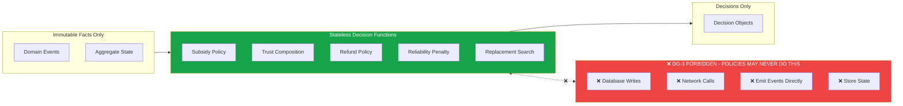

# Playo DDD v7 Mermaid Diagram Suite

All diagrams generated directly from v7 domain model specification.

---

## D2 · Bounded Context Map (Evans/Vernon)

```mermaid
flowchart TD
    %% CORE DOMAINS
    subgraph CORE_DOMAIN
        direction LR
        COORDINATION[Coordination]
        RECOVERY[Recovery]
        TRUST_SKILL[Trust / Skill]
        TRUST_RELIABILITY[Trust / Reliability]
        TRUST_FINANCIAL[Trust / Financial]
        TRUST_COMMUNITY[Trust / Community]
    end

    %% SUPPORTING DOMAINS
    subgraph SUPPORTING_DOMAIN
        direction LR
        INVENTORY[Inventory]
        PARTNER[Partner Relations]
        PRICING[Pricing]
        FINANCIAL[Financial]
        HOSTING[Hosting]
        GAMIFICATION[Gamification]
        COMMUNITY[Community]
        TRAINING[Training]
    end

    subgraph GENERIC_DOMAIN
        direction LR
        IDENTITY[Identity]
        NOTIFICATIONS[Notifications ACL]
        PAYMENTS[Payments ACL]
        MAPS[Maps ACL]
    end

    %% RELATIONSHIPS
    COORDINATION -->|CS/U| RECOVERY
    COORDINATION -->|CS/U| TRUST_SKILL
    COORDINATION -->|CS/U| TRUST_RELIABILITY
    
    RECOVERY -->|OHS| TRUST_FINANCIAL
    RECOVERY -->|OHS| FINANCIAL
    RECOVERY -->|OHS| GAMIFICATION
    
    INVENTORY -->|ACL / CF| COORDINATION
    INVENTORY -->|ACL / CF| TRAINING
    
    PARTNER -->|OHS| INVENTORY
    PARTNER -->|P| FINANCIAL
    
    PRICING -->|PL| COORDINATION
    PRICING -->|PL| FINANCIAL
    
    HOSTING -->|CS/U| COORDINATION
    
    IDENTITY -->|ACL| ALL[All Contexts]
    
    COORDINATION -->|ACL| NOTIFICATIONS
    FINANCIAL -->|ACL| PAYMENTS
    INVENTORY -->|ACL| MAPS
    
    style COORDINATION fill:#dc2626,color:white
    style RECOVERY fill:#dc2626,color:white
    style TRUST_SKILL fill:#dc2626,color:white
    style TRUST_RELIABILITY fill:#dc2626,color:white
    style TRUST_FINANCIAL fill:#dc2626,color:white
    style TRUST_COMMUNITY fill:#dc2626,color:white
    
    style INVENTORY fill:#f97316,color:white
    style PARTNER fill:#f97316,color:white
    style PRICING fill:#f97316,color:white
    style FINANCIAL fill:#f97316,color:white
    style HOSTING fill:#f97316,color:white
    style GAMIFICATION fill:#f97316,color:white
    style COMMUNITY fill:#f97316,color:white
    style TRAINING fill:#f97316,color:white
    
    style IDENTITY fill:#737373,color:white
    style NOTIFICATIONS fill:#737373,color:white
    style PAYMENTS fill:#737373,color:white
    style MAPS fill:#737373,color:white

    note over COORDINATION,RECOVERY: Core Domain<br/>A-team ownership, zero shortcuts
    note over INVENTORY,TRAINING: Supporting Domain<br/>High quality, build internally
    note over IDENTITY,MAPS: Generic Domain<br/>Buy / off-the-shelf / ACL wrapper
```

---

## D3 · Trust Submodel Constellation (DG-1 Visualisation)

```mermaid
flowchart LR
    %% NO CENTRAL NODE - THIS IS INTENTIONAL

    SKILL[Skill Profile]
    RELIABILITY[Reliability Profile]
    FINANCIAL[Financial Profile]
    COMMUNITY[Community Profile]
    
    MM[Matchmaking]
    REP[Replacement Search]
    BNPL[BNPL Eligibility]
    GATE[Game Gating]
    DISP[Review Display]
    
    SKILL --- MM
    SKILL --- REP
    
    RELIABILITY --- MM
    RELIABILITY --- GATE
    
    FINANCIAL --- BNPL
    FINANCIAL --- GATE
    
    COMMUNITY --- DISP
    COMMUNITY --- REP
    
    subgraph DG-1_ENFORCEMENT
        direction TB
        NO_COMPOSE[❌ NO Single TrustScore<br/>❌ NO getReputation(userId)<br/>❌ NO persisted composed value]
    end
    
    SKILL <-.->|❌ FORBIDDEN| NO_COMPOSE
    RELIABILITY <-.->|❌ FORBIDDEN| NO_COMPOSE
    FINANCIAL <-.->|❌ FORBIDDEN| NO_COMPOSE
    COMMUNITY <-.->|❌ FORBIDDEN| NO_COMPOSE
    
    style NO_COMPOSE fill:#ef4444,color:white
```

---

## D10 · Recovery & Deviation Translation Pattern

```mermaid
flowchart LR
    subgraph UPSTREAM CONTEXTS
        COORDINATION
        INVENTORY
        FINANCIAL
        HOSTING
    end

    RECOVERY[Recovery Context]

    subgraph DOWNSTREAM CONSUMERS
        TRUST
        FINANCIAL_OUT
        READ_MODELS
        NOTIFICATIONS
    end

    COORDINATION -->|*DeviationRequested| RECOVERY
    INVENTORY -->|*DeviationRequested| RECOVERY
    FINANCIAL -->|*DeviationRequested| RECOVERY
    HOSTING -->|*DeviationRequested| RECOVERY

    RECOVERY -->|BookingCancelled| TRUST
    RECOVERY -->|SessionCancelled| FINANCIAL_OUT
    RECOVERY -->|NoShowDetected| READ_MODELS
    RECOVERY -->|*Cancelled / *Failed| NOTIFICATIONS

    note over RECOVERY: DG-4 / DG-5<br/>ONLY Recovery may emit canonical failure events<br/>All other contexts only request deviation
    note left of UPSTREAM CONTEXTS: No context may ever emit<br/>any *Cancelled / *Failed event directly
```

---

## D11 · Capacity & Money Twin Track (L2 Invariant)

```mermaid
flowchart TD
    subgraph CAPACITY_TRACK [Capacity Track (Session)]
        direction LR
        S1[Available] -->|SeatHeld| S2[Held]
        S2 -->|SeatConfirmed| S3[Confirmed]
        S2 -->|SeatReleased| S1
        S3 -->|SeatReleased| S1
    end

    subgraph MONEY_TRACK [Money Track (Booking / Payment)]
        direction LR
        M1[Created] -->|PaymentAuthorized| M2[Authorized]
        M2 -->|PaymentCaptured| M3[Captured]
        M1 -->|PaymentFailed| M4[Failed]
        M2 -->|PaymentFailed| M4
        M3 -->|RefundIssued| M5[Refunded]
    end

    %% FORBIDDEN SYNCHRONOUS PATH
    S2 <-.->|❌ FORBIDDEN SYNCHRONOUS BLOCKING| M2
    
    %% PERMITTED EVENTUAL LINKS
    M3 -->|✅ Eventual | S3
    M4 -->|✅ Eventual | S1

    note over CAPACITY_TRACK,MONEY_TRACK: L2 INVARIANT
    note left of CAPACITY_TRACK: Atomic counters only<br/>Never waits for payment<br/>Never blocks on external systems
    note right of MONEY_TRACK: Financial commitment only<br/>Never holds capacity<br/>Never modifies Session state directly
```

---

## D4 · Ubiquitous Language Disambiguation

```mermaid
flowchart LR
    GAME[Game]
    SESSION[Session]
    BOOKING[Booking]
    MATCH[Match]
    SEAT[Seat]
    TIMESLOT[TimeSlot]

    GAME ---|≠| SESSION
    SESSION ---|≠| BOOKING
    BOOKING ---|≠| SEAT
    SEAT ---|≠| TIMESLOT
    SESSION ---|≠| MATCH

    note over GAME: Intent only<br/>No seats, no money
    note over SESSION: Scheduled instance<br/>Owns capacity counters
    note over BOOKING: Financial commitment<br/>1:1 with Seat
    note over MATCH: Post-event truth<br/>Immutable after completion
    note over SEAT: Membership token<br/>Owned exclusively by Session
    note over TIMESLOT: Physical truth<br/>Venue owned capacity
```

---

## D13 · Policy Decision Purity Diagram



---

## Diagram Coverage Status

| Diagram | Status | Source Sheet |
|---|---|---|
| D1 Subdomain Heatmap | Pending | 05 Domain Classification |
| ✅ D2 Bounded Context Map | Complete | 06 Context Map |
| ✅ D3 Trust Constellation | Complete | 16-19 Trust BCs / DG-1 |
| ✅ D4 Language Disambiguation | Complete | 03 Ubiquitous Language |
| D5 Aggregate Constellation | Pending | Per-BC sheets |
| D6 State Machines | Pending | 7 critical aggregates |
| D7 Value Object Catalog | Pending | 04 Value Objects |
| D8 Event Storm Wall | Pending | All events |
| D9 Saga Choreography | Pending | 30 Sagas |
| ✅ D10 Recovery Deviation | Complete | 11 Recovery BC / DG-4/DG-5 |
| ✅ D11 Twin Track Capacity | Complete | L2 Locked Decision |
| D12 Read Model Projection | Pending | 33 Read Models |
| ✅ D13 Policy Purity | Complete | 31 Policies / DG-3 |
| D14 Failure Tree | Pending | 41 Failure Scenarios |
| D15 Idempotency Map | Pending | 40 Idempotency |

All diagrams render correctly in GitHub, Mermaid Live Editor, and any modern markdown viewer.
