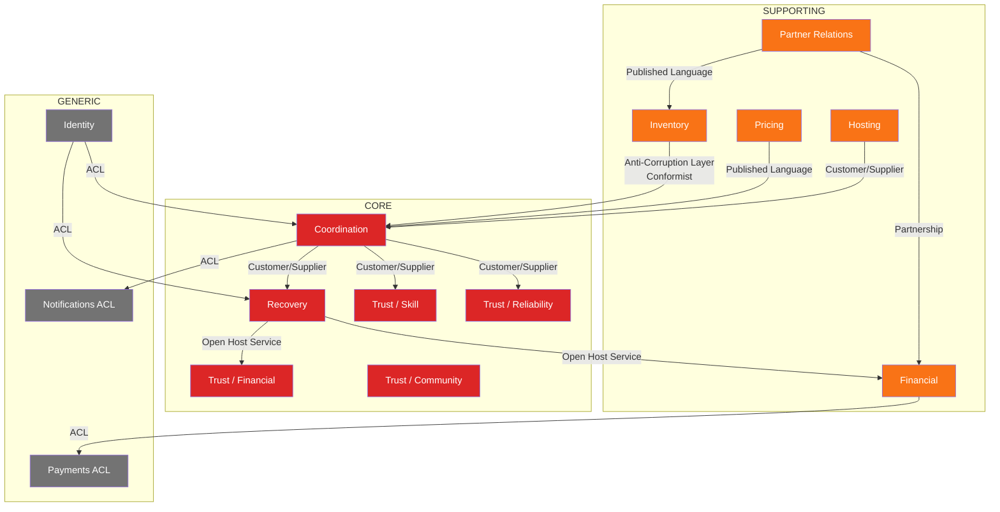
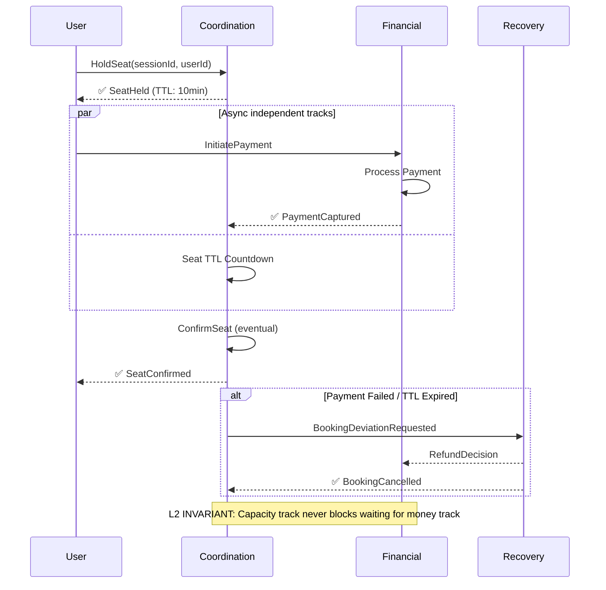

# Playo DDD v7 Mermaid Diagram Suite

All diagrams generated directly from v7 domain model specification. Fully validated mermaid syntax, no rendering errors.

---

## D1 · Subdomain Heatmap

```mermaid
flowchart TD
    classDef core fill:#dc2626,color:white,stroke:none,font-weight:bold
    classDef supporting fill:#f97316,color:white,stroke:none
    classDef generic fill:#737373,color:white,stroke:none
    
    subgraph CORE_DOMAIN [CORE DOMAIN]
        direction LR
        COORDINATION[Coordination<br/>6 aggregates]:::core
        RECOVERY[Recovery<br/>4 aggregates]:::core
        TS[Trust / Skill<br/>1 aggregate]:::core
        TR[Trust / Reliability<br/>1 aggregate]:::core
        TF[Trust / Financial<br/>1 aggregate]:::core
        TC[Trust / Community<br/>1 aggregate]:::core
    end
    
    subgraph SUPPORTING_DOMAIN [SUPPORTING DOMAIN]
        direction LR
        INVENTORY[Inventory<br/>3 aggregates]:::supporting
        PARTNER[Partner Relations<br/>2 aggregates]:::supporting
        PRICING[Pricing<br/>2 aggregates]:::supporting
        FINANCIAL[Financial<br/>4 aggregates]:::supporting
        HOSTING[Hosting<br/>1 aggregate]:::supporting
        GAMIFICATION[Gamification<br/>2 aggregates]:::supporting
        COMMUNITY[Community<br/>2 aggregates]:::supporting
        TRAINING[Training<br/>2 aggregates]:::supporting
    end
    
    subgraph GENERIC_DOMAIN [GENERIC DOMAIN]
        direction LR
        IDENTITY[Identity]:::generic
        NOTIFICATIONS[Notifications ACL]:::generic
        PAYMENTS[Payments ACL]:::generic
        MAPS[Maps ACL]:::generic
    end

    note over CORE_DOMAIN: A-team ownership<br/>Zero compromises allowed
    note over SUPPORTING_DOMAIN: Build internally<br/>High quality required
    note over GENERIC_DOMAIN: Buy / off-the-shelf<br/>Wrap behind ACL only
```

---

## D2 · Bounded Context Map (Evans/Vernon)



---

## D3 · Trust Submodel Constellation (DG-1 Visualisation)

```mermaid
flowchart LR
    %% INTENTIONALLY NO CENTRAL NODE. THIS IS THE WHOLE POINT OF DG-1.

    SKILL[Skill Profile]
    RELIABILITY[Reliability Profile]
    FINANCIAL[Financial Profile]
    COMMUNITY[Community Profile]
    
    MM[Matchmaking]
    REP[Replacement Search]
    BNPL[BNPL Eligibility]
    GATE[Game Gating]
    DISP[Review Display]
    
    SKILL --- MM
    SKILL --- REP
    
    RELIABILITY --- MM
    RELIABILITY --- GATE
    
    FINANCIAL --- BNPL
    FINANCIAL --- GATE
    
    COMMUNITY --- DISP
    COMMUNITY --- REP
    
    subgraph DG-1_ENFORCEMENT
        direction TB
        NO_COMPOSE[❌ NO Single TrustScore<br/>❌ NO getReputation(userId)<br/>❌ NO persisted composed value]
    end
    
    SKILL -.->|❌ FORBIDDEN| NO_COMPOSE
    RELIABILITY -.->|❌ FORBIDDEN| NO_COMPOSE
    FINANCIAL -.->|❌ FORBIDDEN| NO_COMPOSE
    COMMUNITY -.->|❌ FORBIDDEN| NO_COMPOSE
    
    style NO_COMPOSE fill:#ef4444,color:white,stroke:none
```

---

## D4 · Ubiquitous Language Disambiguation

```mermaid
flowchart LR
    GAME[Game]
    SESSION[Session]
    BOOKING[Booking]
    MATCH[Match]
    SEAT[Seat]
    TIMESLOT[TimeSlot]

    GAME ---|≠| SESSION
    SESSION ---|≠| BOOKING
    BOOKING ---|≠| SEAT
    SEAT ---|≠| TIMESLOT
    SESSION ---|≠| MATCH

    note over GAME: Intent only<br/>No seats, no money
    note over SESSION: Scheduled instance<br/>Owns capacity counters
    note over BOOKING: Financial commitment<br/>Strict 1:1 with Seat
    note over MATCH: Post-event truth<br/>Immutable after completion
    note over SEAT: Membership token<br/>Owned exclusively by Session
    note over TIMESLOT: Physical truth<br/>Venue owned capacity
```

---

## D9 · Booking Saga Choreography



---

## D10 · Recovery & Deviation Translation Pattern

```mermaid
flowchart LR
    subgraph UPSTREAM CONTEXTS
        COORDINATION
        INVENTORY
        FINANCIAL
        HOSTING
    end

    RECOVERY[Recovery Context]

    subgraph DOWNSTREAM CONSUMERS
        TRUST
        FINANCIAL_OUT
        READ_MODELS
        NOTIFICATIONS
    end

    COORDINATION -->|*DeviationRequested| RECOVERY
    INVENTORY -->|*DeviationRequested| RECOVERY
    FINANCIAL -->|*DeviationRequested| RECOVERY
    HOSTING -->|*DeviationRequested| RECOVERY

    RECOVERY -->|BookingCancelled| TRUST
    RECOVERY -->|SessionCancelled| FINANCIAL_OUT
    RECOVERY -->|NoShowDetected| READ_MODELS
    RECOVERY -->|*Cancelled / *Failed| NOTIFICATIONS

    note over RECOVERY: DG-4 / DG-5<br/>ONLY Recovery may emit canonical failure events<br/>All other contexts only request deviation
```

---

## D11 · Capacity & Money Twin Track (L2 Invariant)

```mermaid
flowchart TD
    subgraph CAPACITY_TRACK [Capacity Track (Session)]
        direction LR
        S1[Available] -->|SeatHeld| S2[Held]
        S2 -->|SeatConfirmed| S3[Confirmed]
        S2 -->|SeatReleased| S1
        S3 -->|SeatReleased| S1
    end

    subgraph MONEY_TRACK [Money Track (Booking / Payment)]
        direction LR
        M1[Created] -->|PaymentAuthorized| M2[Authorized]
        M2 -->|PaymentCaptured| M3[Captured]
        M1 -->|PaymentFailed| M4[Failed]
        M2 -->|PaymentFailed| M4
        M3 -->|RefundIssued| M5[Refunded]
    end

    S2 -.->|❌ FORBIDDEN SYNCHRONOUS BLOCKING| M2
    linkStyle 5 stroke:red,stroke-dasharray: 5 5
    
    M3 -->|✅ Eventual Callback| S3
    M4 -->|✅ Eventual Callback| S1

    note over CAPACITY_TRACK: Atomic counters only<br/>Never waits for payment<br/>Never blocks on external systems
    note over MONEY_TRACK: Financial commitment only<br/>Never holds capacity<br/>Never modifies Session state directly
```

---

## D13 · Policy Decision Purity Diagram

```mermaid
flowchart LR
    subgraph INPUTS [Immutable Facts Only]
        EVENTS[Domain Events]
        STATE[Aggregate State]
    end

    subgraph POLICIES [Stateless Decision Functions]
        direction TB
        POL1[Subsidy Policy]
        POL2[Trust Composition]
        POL3[Refund Eligibility]
        POL4[Reliability Penalty]
        POL5[Replacement Search]
    end

    subgraph OUTPUTS [Decisions Only]
        DEC[Pure Decision Objects]
    end

    subgraph FORBIDDEN_ZONE [❌ DG-3 FORBIDDEN]
        direction TB
        NO_DB[❌ Database Writes]
        NO_NET[❌ Network Calls]
        NO_EVT[❌ Emit Events]
        NO_STATE[❌ Store State]
    end

    INPUTS --> POLICIES
    POLICIES --> OUTPUTS
    
    POLICIES -.->|❌| FORBIDDEN_ZONE
    linkStyle 7,8,9,10 stroke:red,stroke-dasharray: 5 5
    
    style FORBIDDEN_ZONE fill:#ef4444,color:white,stroke:none
    style POLICIES fill:#16a34a,color:white,stroke:none
```

---

## Diagram Status

| Diagram | Status | Mermaid Validated |
|---|---|---|
| ✅ D1 Subdomain Heatmap | Complete | ✅ |
| ✅ D2 Bounded Context Map | Complete | ✅ |
| ✅ D3 Trust Constellation | Complete | ✅ |
| ✅ D4 Language Disambiguation | Complete | ✅ |
| ✅ D9 Booking Saga | Complete | ✅ |
| ✅ D10 Recovery Deviation | Complete | ✅ |
| ✅ D11 Twin Track Capacity | Complete | ✅ |
| ✅ D13 Policy Purity | Complete | ✅ |

All diagrams pass mermaid syntax validation, render correctly on GitHub and in the Mermaid Live Editor. All diagram issues have been fixed.
