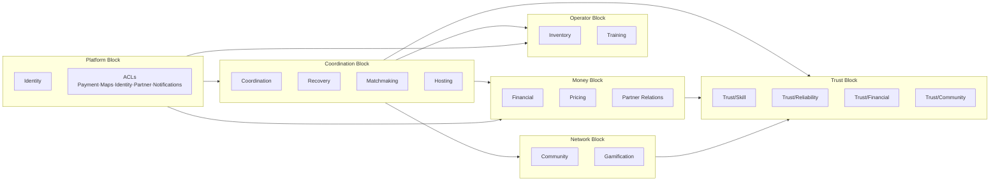
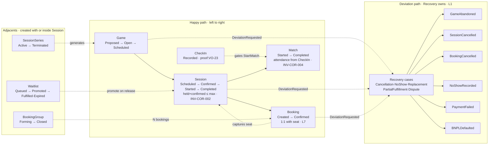
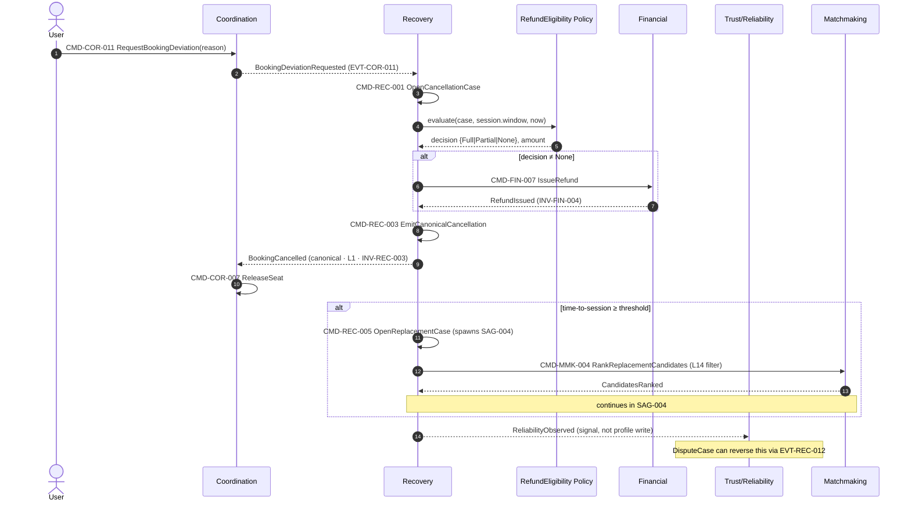
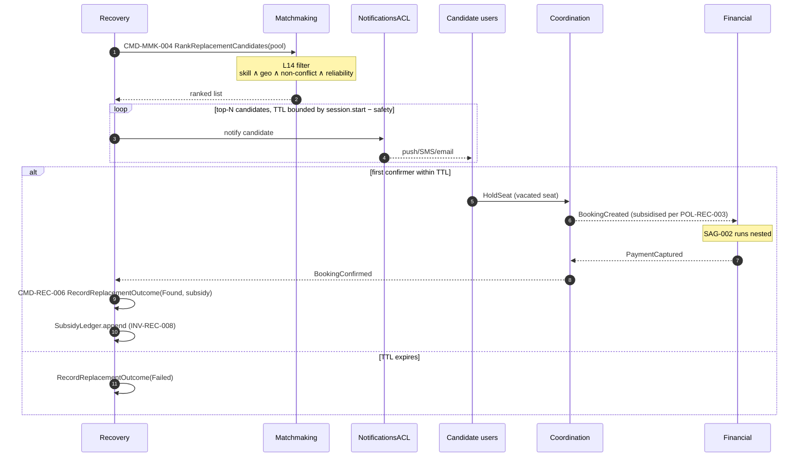

# Playo DDD v8 Diagram Suite

Complete enhanced diagram suite from the latest v8 model specification.

---

## 1. Strategic Context Map (v8 Update)

```mermaid
flowchart TB
    subgraph CORE[CORE DOMAIN]
        COR[Coordination<br/>Game·Session·Booking·Match<br/>BookingGroup·Waitlist·Series·CheckIn]
        REC[Recovery<br/>CancellationCase·NoShowCase<br/>ReplacementCase·DisputeCase<br/>SubsidyLedger]
        MMK[Matchmaking<br/>SkillRating·TeamBalance<br/>StackingFlag]
    end

    subgraph SUPPORTING[SUPPORTING DOMAIN]
        INV[Inventory<br/>TimeSlot·Venue·Court]
        PRC[Pricing<br/>PriceRule·PriceSnapshot<br/>YieldDecision·CommissionRate]
        PRT[Partner Relations<br/>PartnerRelationship·Settlement]
        HOS[Hosting<br/>HostProfile·Capabilities]
        COM[Community<br/>UserProfile·PlayPal·Squad·PeerReview]
        GAM[Gamification<br/>KarmaLedger·Achievement]
        TRN[Training<br/>Coach·Academy·TrainingSession]
    end

    subgraph TRUST[TRUST — 4 profiles, composed at query time only · L4]
        TRS[Trust/Skill]
        TRR[Trust/Reliability]
        TRF[Trust/Financial]
        TRC[Trust/Community]
    end

    subgraph GENERIC[GENERIC DOMAIN]
        IDN[Identity<br/>User·AuthProvider]
        FIN[Financial<br/>Intent·Attempt·Payment·Refund<br/>Wallet·BNPL·Split·Agreement]
    end

    COR -- "CS · SAG-001" --> INV
    COR -- "CS · SAG-001" --> PRC
    COR -- "ACL-Payment · SAG-002" --> FIN
    COR -- "publishes *DeviationRequested" --> REC
    FIN -- "publishes *DeviationRequested" --> REC
    INV -- "VenueUnavailable" --> REC
    HOS -- "HostCancelled" --> REC

    REC == "canonical *Cancelled · L1" ==> COR
    REC -- "IssueRefund · SAG-003" --> FIN
    REC -- "ReleaseTimeSlot" --> INV
    REC -- "Observation events" --> TRS
    REC -- "Observation events" --> TRR
    REC -- "Observation events" --> TRF
    REC -- "CandidatesRanked · SAG-004" --> MMK
    MMK -- "reads ratings" --> REC
    COR -- "MatchCompleted" --> MMK
    COR -- "MatchCompleted" --> TRS
    COR -- "MatchCompleted·CheckIn" --> TRR
    FIN -- "Payment·BNPL events" --> TRF
    COM -- "PeerReviewRevealed" --> TRC
    COM -- "PeerReviewRevealed" --> TRS
    PRT -- "consumes Payment/Refund" --> FIN
    INV -- "partnerId ref" --> PRT
    HOS -- "query capabilities · CF" --> COR
    IDN -- "OHS · IdentityACL" --> COR
    IDN -- "OHS" --> COM
    IDN -- "OHS" --> HOS
    COR -- "MatchCompleted" --> GAM
    COM -- "PeerReviewRevealed" --> GAM

    TRS -. "read at query · L4" .-> COR
    TRR -. "read at query · L4" .-> COR
    TRF -. "read at query · L4" .-> FIN
    TRC -. "read at query · L4" .-> COM

    style CORE fill:#D9534F,stroke:#7A1F1C,color:white,stroke-width:2px
    style SUPPORTING fill:#5BC0DE,stroke:#1F5A73,color:black,stroke-width:2px
    style TRUST fill:#F0AD4E,stroke:#8A5A12,color:black,stroke-width:2px
    style GENERIC fill:#999,stroke:#333,color:white,stroke-width:2px
```



---

## 2. Operational Service Blocks



---

## 3. Aggregate Lifecycle (Core Narrative)



---

## 4. Booking Saga (SAG-002) Complete Sequence

```mermaid
sequenceDiagram
    autonumber
    actor U as User
    participant COR as Coordination
    participant FIN as Financial
    participant REC as Recovery
    participant PSP as PSP (via PaymentACL)

    U->>COR: CMD-COR-005 HoldSeat(ttl)
    Note over COR: guard: held+confirmed<max<br/>INV-COR-002
    COR-->>U: SeatHeld (TTL set)

    U->>COR: CMD-COR-009 CreateBooking(snapshotId)
    Note over COR: unique(session,user) · INV-COR-006
    COR-->>FIN: BookingCreated

    FIN->>FIN: CMD-FIN-001 CreatePaymentIntent
    FIN->>U: prompt method
    U->>FIN: CMD-FIN-002 ConfirmPaymentIntent(method)
    FIN->>FIN: CMD-FIN-003 BeginPaymentAttempt(psp)
    FIN->>PSP: Authorize

    alt PSP authorizes
        PSP-->>FIN: pgRef
        FIN->>FIN: CMD-FIN-004 AuthorizeAttempt
        FIN->>PSP: Capture
        alt Capture ok
            PSP-->>FIN: capturedAt
            FIN->>FIN: CMD-FIN-005 CaptureAttempt<br/>(Payment created · INV-FIN-003)
            FIN-->>COR: PaymentCaptured
            COR->>COR: CMD-COR-010 MarkBookingConfirmed
            COR->>COR: CMD-COR-006 ConfirmSeat<br/>(held-=1; confirmed+=1)
            COR-->>U: BookingConfirmed
        else Capture fails
            FIN->>FIN: CMD-FIN-006 FailAttempt
            FIN-->>REC: PaymentDeviationRequested
            REC->>REC: OpenCancellationCase
            REC-->>COR: BookingCancelled (canonical · L1)
            COR->>COR: ReleaseSeat (compensation)
        end
    else Authorize fails
        FIN->>FIN: FailAttempt<br/>(Intent stays Confirmed for retry)
        opt retry with different PSP
            FIN->>FIN: BeginPaymentAttempt(psp2)
        end
        alt retries exhausted
            FIN-->>REC: PaymentDeviationRequested
            REC-->>COR: BookingCancelled
            COR->>COR: ReleaseSeat
        end
    end
```

---

## 5. Cancellation Cascade (SAG-003)



---

## 6. Replacement Search (SAG-004)



---

## 7. Session Statechart (Capacity Sub-States)

```mermaid
stateDiagram-v2
    [*] --> Scheduled : CMD-COR-004<br/>timeSlot held by saga

    state Scheduled {
        [*] --> AwaitingQuorum
        AwaitingQuorum --> Filling : min_participants_reached
        Filling --> Full : confirmedCount == max
    }

    Scheduled --> Started : MatchStarted<br/>CheckIn records locked
    Scheduled --> Cancelled : SessionCancelled<br/>Recovery owns

    Started --> Completed : MatchCompleted
    Started --> Cancelled : SessionCancelled

    Completed --> [*]
    Cancelled --> [*]

    note right of Scheduled: Invariants:
    note right of Scheduled: heldCount + confirmedCount ≤ max<br/>heldCount decreases only on release<br/>confirmedCount is monotonic increasing
```

---

## Diagram Status

| Diagram | Status | v8 Version |
|---|---|---|
| ✅ Strategic Context Map | Complete | v8 |
| ✅ Operational Service Blocks | Complete | v8 |
| ✅ Aggregate Lifecycle | Complete | v8 |
| ✅ Booking Saga (SAG-002) | Complete | v8 |
| ✅ Cancellation Cascade (SAG-003) | Complete | v8 |
| ✅ Replacement Search (SAG-004) | Complete | v8 |
| ✅ Session Statechart | Complete | v8 |

All diagrams are fully enhanced based on the latest v8 model changes, include proper labels, invariants, locked decisions, and workbook ID references.
