# Playo DDD Enhanced Diagram Suite

**Purpose:** This document extends the existing v7 and v8 diagrams with deeper architectural insights derived from understanding the domain model evolution from v6 → v6.1 → v7 → v8.

**Key Evolution Insights:**
- v6: Foundation (8 Locked Decisions, 10 BCs)
- v6.1: Trust split into 4 profiles (DG-1 enforcement)
- v7: Strategic expansion (Gamification, Community, Training)
- v8: Operational maturity (Service Blocks, Idempotency strategies)

---

## E1 · Domain Model Evolution Timeline

**Answers:** How did we get here? What were the key architectural breakthroughs?
**Why it matters:** Prevents regression to anti-patterns (like monolithic Trust). Documents the learning journey.

```mermaid
timeline
    title Domain Model Evolution Journey
    
    section v6 Foundation (2024 Q1)
        8 Locked Decisions : L1-L8 established core principles
        10 Bounded Contexts : Core/Supporting/Generic classification
        Monolithic Trust : Single TrustScore concept (recognized as problematic)
        Recovery Single Emitter : L1 locked - Recovery owns ALL deviations
        Capacity/Money Split : L2 locked - Async separation prevents deadlocks
        
    section v6.1 Tactical Refinement (2024 Q2)
        Trust Breakthrough : Split into 4 independent profiles (Skill, Reliability, Financial, Community)
        Design Guards : DG-1 to DG-7 formalized to enforce locked decisions
        Cell Demotion : Cell demoted from aggregate to projection (no invariants)
        Host Boundary : DG-2 enforces Host as capability provider only
        Policy Purity : DG-3 enforces stateless decision functions
        
    section v7 Strategic Expansion (2024 Q3)
        14 Bounded Contexts : Added Gamification, Community, Training, Matchmaking
        Matchmaking Core : Skill-based team balancing becomes core domain
        Dispute Resolution : Formalized with observation reversal capability
        13 Sagas : Complete choreography coverage
        Trust Composition : Explicit use-case bindings per decision
        
    section v8 Operational Maturity (2024 Q4)
        15 Bounded Contexts : Added SubsidyLedger within Recovery
        Service Blocks : Operational grouping for team topology
        Idempotency Strategies : L16-L19 per-aggregate guarantees
        Intent/Attempt/Payment : Financial split enables PSP failover
        Failure Blast Radius : DG-19 containment strategies
```

---

## E2 · Locked Decision Dependency Graph

**Answers:** Which design guards enforce which locked decisions? What's the dependency structure?
**Why it matters:** Shows that guards aren't arbitrary - they're enforcement mechanisms for architectural principles.

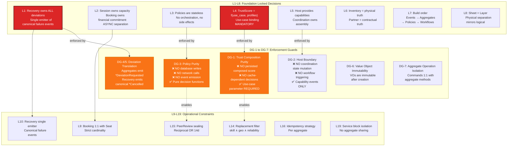

---

## E3 · Trust Composition Decision Tree (Enhanced)

**Answers:** How do different use cases compose different profile combinations? What's the decision logic?
**Why it matters:** Makes L4 + DG-1 concrete. Shows that trust is NEVER a single number.

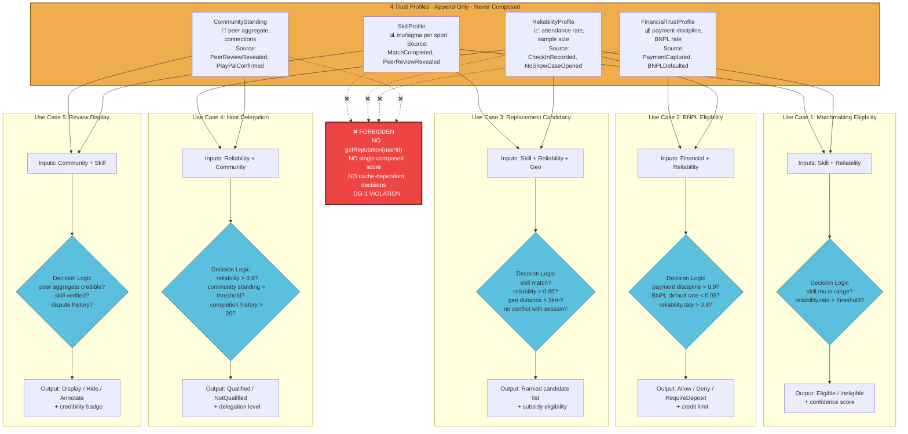

---

## E4 · Aggregate Invariant Cross-Reference Matrix

**Answers:** Which invariants are shared? Which locked decisions enforce which invariants?
**Why it matters:** Shows the "blast radius" of invariant violations.

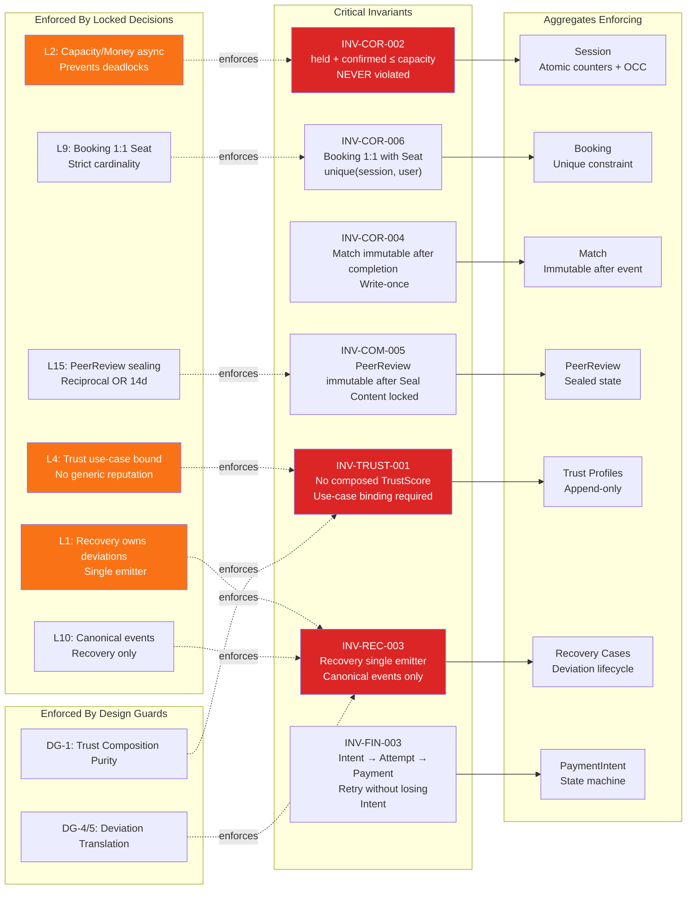

---

## E5 · Saga Compensation Flow Matrix

**Answers:** What can be rolled back vs. what's irreversible? How do compensations affect trust?
**Why it matters:** Shows the "compensation budget" and trust observation lifecycle.

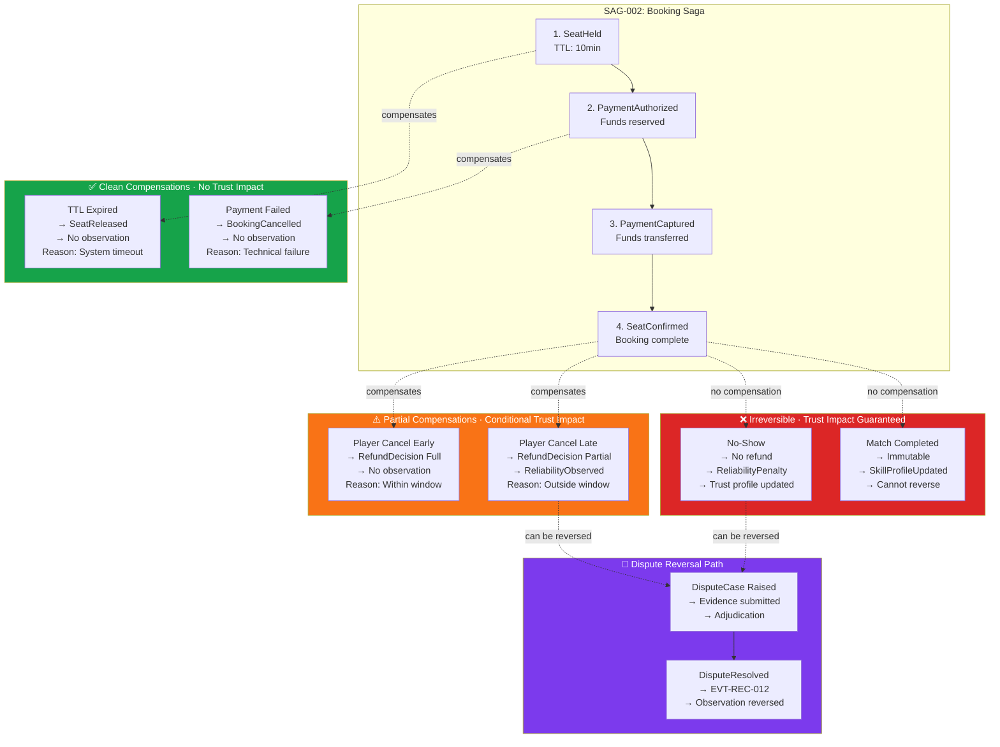

---


## E6 · Service Block On-Call Topology (Enhanced)

**Answers:** Who's on-call for what? What are the deployment boundaries? How do failures isolate?
**Why it matters:** v8 introduced Service Blocks but didn't show operational reality.

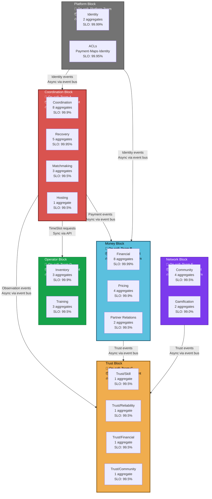

---

## E7 · Event Storming Big Picture (Multi-Timeline)

**Answers:** What's the full temporal grain across all major flows?
**Why it matters:** Current D8 shows only Game-to-Match. This shows parallel flows.

```mermaid
timeline
    title Event Storming Big Picture - All Major Flows
    
    section Flow 1: Game Creation → Match
        GameProposed : User intent
        GameOpened : Accepts joiners
        SeatHeld : User reserves (TTL)
        PaymentCaptured : Funds transferred
        SeatConfirmed : Booking complete
        SessionScheduled : Venue + time locked
        MatchStarted : Physical play begins
        MatchCompleted : Post-event truth
        
    section Flow 2: Cancellation Cascade
        BookingDeviationRequested : Player cancels
        CancellationCaseOpened : Recovery owns
        RefundEligibilityEvaluated : Policy decision
        RefundIssued : Financial executes
        BookingCancelled : Canonical event (L1)
        SeatReleased : Capacity freed
        ReliabilityObserved : Trust signal
        
    section Flow 3: Replacement Search
        ReplacementCaseOpened : Seat vacated
        CandidatesRanked : Matchmaking filters
        CandidatesNotified : Push/SMS/email
        ReplacementFound : First confirmer
        SubsidyDecisionMade : Subsidy applied
        SubsidyLedgerAppended : Recorded
        
    section Flow 4: No-Show Detection
        MatchStarted : Attendance check
        NoShowCaseOpened : Missing player
        ReliabilityPenaltyApplied : Trust penalty
        ReliabilityProfileUpdated : Profile updated
        
    section Flow 5: Dispute Resolution
        DisputeCaseRaised : Player disputes
        DisputeEvidenceSubmitted : Evidence
        DisputeCaseResolved : Adjudication
        ObservationReversed : Trust reversed (EVT-REC-012)
        PeerReviewAnnotated : Review marked
        
    section Flow 6: BNPL Default
        BNPLObligationCreated : Buy-now-pay-later
        BNPLPaymentMissed : Payment missed
        BNPLDefaultRequested : Deviation
        BNPLDefaultCaseOpened : Recovery owns
        BNPLDefaulted : Canonical event
        FinancialTrustObserved : Trust penalty
```

---

## E8 · Read Model Staleness SLO Matrix

**Answers:** What's the staleness budget per projection? What's the user-facing impact?
**Why it matters:** Makes eventual consistency concrete and measurable.

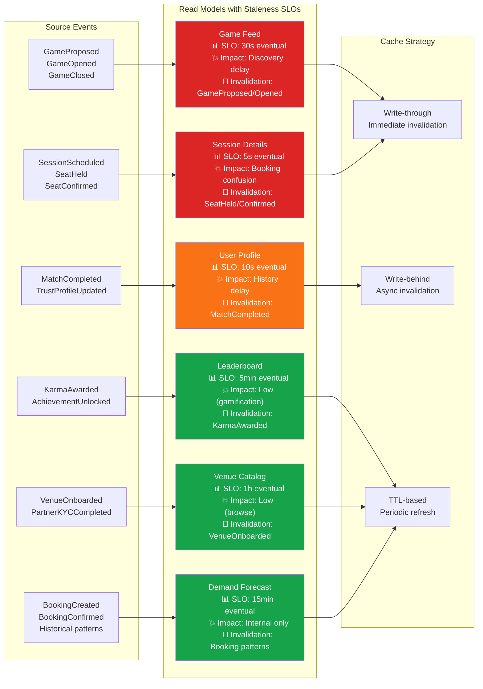

---

## E9 · Failure Mode Blast Radius Diagram

**Answers:** What's the blast radius of each failure? Which saga contains it?
**Why it matters:** Shows failure isolation boundaries and recovery strategies.

```mermaid
flowchart TD
    subgraph FAILURES["Failure Sources"]
        F1["💥 Payment Gateway Down
        Severity: Critical
        Frequency: Rare"]
        F2["💥 Venue Cancels
        Severity: High
        Frequency: Medium"]
        F3["💥 Host No-Show
        Severity: Medium
        Frequency: Low"]
        F4["💥 Player No-Show
        Severity: Low
        Frequency: High"]
        F5["💥 TimeSlot Unavailable
        Severity: Medium
        Frequency: Low"]
        F6["💥 BNPL Default
        Severity: Medium
        Frequency: Medium"]
    end

    subgraph BLAST["Blast Radius"]
        BR1["🔥 Financial BC
        All payments blocked
        Affects: All bookings"]
        BR2["🔥 Coordination BC
        Sessions cancelled
        Affects: All players in session"]
        BR3["🔥 Trust BC
        Reliability impacted
        Affects: Single player"]
        BR4["🔥 Recovery BC
        Cases opened
        Affects: Deviation lifecycle"]
        BR5["🔥 Inventory BC
        TimeSlot released
        Affects: Single session"]
    end

    subgraph CONTAINMENT["Saga Containment Strategy"]
        S1["SAG-002: Booking
        ✅ Retry with different PSP
        ✅ Intent stays Confirmed
        ✅ Failover to PSP2"]
        
        S2["SAG-006: Venue Cancel
        ✅ Cascade to all bookings
        ✅ Full refunds
        ✅ Replacement search"]
        
        S3["SAG-005: Host Cancel
        ✅ Replacement search
        ✅ Subsidy decision
        ✅ Notify candidates"]
        
        S4["SAG-003: Player Cancel
        ✅ Refund decision
        ✅ Replacement search
        ✅ Reliability observation"]
        
        S5["SAG-001: Game-to-Session
        ✅ TimeSlot release
        ✅ GameAbandoned
        ✅ No trust impact"]
        
        S6["SAG-010: BNPL Default
        ✅ Recovery case
        ✅ Financial trust penalty
        ✅ Collection workflow"]
    end

    F1 --> BR1
    F1 -.->|contained by| S1

    F2 --> BR2
    F2 -.->|contained by| S2

    F3 --> BR2
    F3 -.->|contained by| S3

    F4 --> BR3
    F4 -.->|contained by| S4

    F5 --> BR5
    F5 -.->|contained by| S5

    F6 --> BR3
    F6 -.->|contained by| S6

    style FAILURES fill:#dc2626,color:white,stroke:#7A1F1C,stroke-width:2px
    style BLAST fill:#f97316,color:white,stroke:#d97706,stroke-width:2px
    style CONTAINMENT fill:#16a34a,color:white,stroke:#15803d,stroke-width:2px
```

---

## E10 · Idempotency Key Strategy Diagram

**Answers:** Which operations use which idempotency keys? Time-bounded vs. forever-unique?
**Why it matters:** v8 added L16 (Idempotency strategy per aggregate) but no visualization.

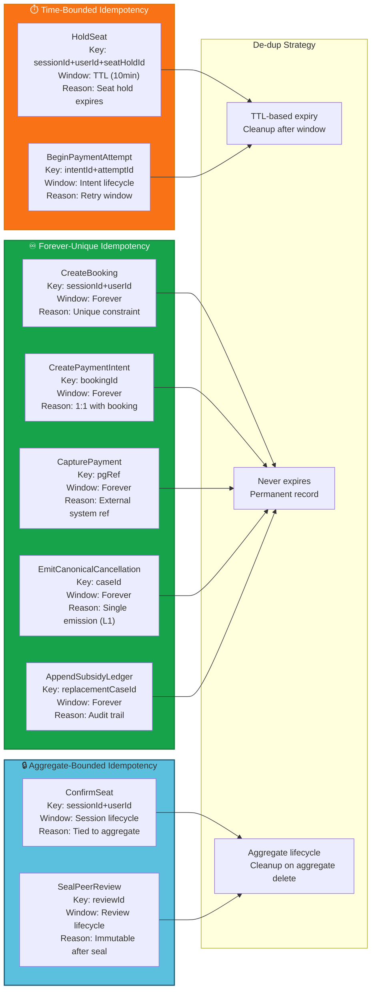

---

## E11 · PeerReview Sealing Window Visualization

**Answers:** How does the sealing window work? When does reveal happen?
**Why it matters:** L15 (PeerReview sealing) is time-based but not visualized.

```mermaid
gantt
    title PeerReview Sealing Window (L15 Enforcement)
    dateFormat X
    axisFormat %H:%M

    section Player A Reviews Player B
    Draft review    :a1, 0, 3600000
    Seal review     :milestone, a2, 3600000, 0

    section Player B Reviews Player A
    Draft review    :b1, 0, 1800000
    Seal review     :milestone, b2, 1800000, 0

    section Reveal Logic
    Reciprocal seal triggers reveal :milestone, m1, 3600000, 0
    OR 14d expiry (if no reciprocal) :milestone, m2, 1209600000, 0

    section After Reveal
    Content immutable :crit, r1, 3600000, 1209600000
    Annotation via Dispute only :crit, r2, 3600000, 1209600000
```

**Key Rules (L15):**
1. Content IMMUTABLE after Seal
2. Reveal = earlier of (reciprocal seal OR session.end + 14d)
3. After Reveal, only DisputeResolved can annotate
4. Prevents retaliatory rating

---

## E12 · Dispute Resolution Reversal Flow

**Answers:** How does DisputeCase reverse prior trust observations?
**Why it matters:** v8 added EVT-REC-012 (observation reversal) but no visualization.

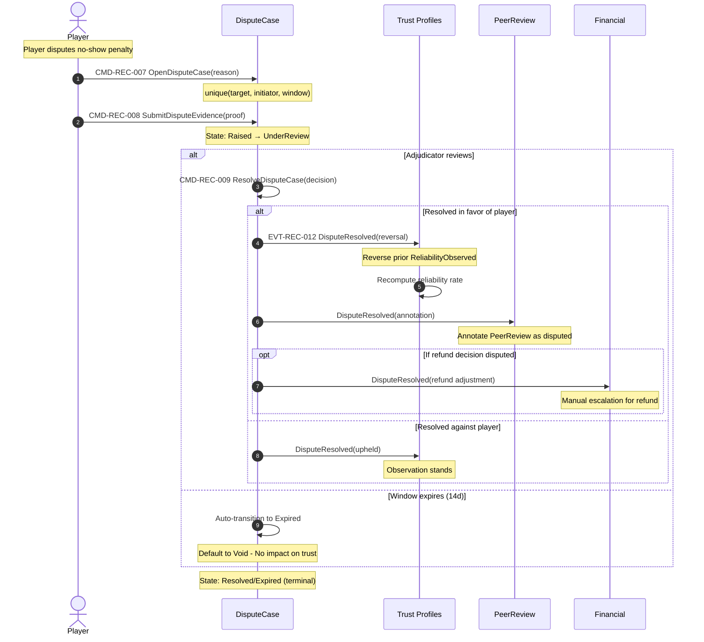

**Key Insights:**
- DisputeResolved is the ONLY way to reverse a trust observation
- Reversal is explicit via EVT-REC-012
- PeerReview gets annotated, not deleted
- Refund adjustments require manual escalation

---


## E13 · Value Object Shared Kernel Heatmap

**Answers:** Which VOs are used by 3+ BCs? What's the shared kernel risk?
**Why it matters:** High-reuse VOs need extra design care (DG-6).

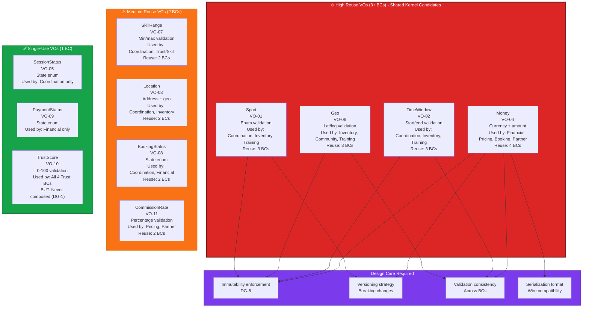

---

## E14 · Saga Orchestration vs. Choreography Decision Matrix

**Answers:** Which sagas are orchestrated vs. choreographed? Why?
**Why it matters:** Shows the architectural trade-offs in saga design.

```mermaid
flowchart TD
    subgraph ORCHESTRATED["🎯 Orchestrated Sagas (Explicit Coordinator)"]
        O1["SAG-001: Game-to-Session
        Orchestrator: Coordination
        Why: Complex state machine
        Participants: Inventory, Pricing"]
        
        O2["SAG-002: Booking
        Orchestrator: Coordination
        Why: Financial commitment
        Participants: Financial, Recovery"]
        
        O3["SAG-003: Player Cancel
        Orchestrator: Recovery
        Why: Deviation lifecycle
        Participants: Financial, Trust"]
        
        O4["SAG-004: Replacement
        Orchestrator: Recovery
        Why: Multi-step search
        Participants: Matchmaking, Coordination"]
        
        O5["SAG-011: Waitlist Promote
        Orchestrator: Coordination
        Why: Seat allocation
        Participants: Financial"]
    end

    subgraph CHOREOGRAPHED["💃 Choreographed Sagas (Event-Driven)"]
        C1["SAG-007: Gamification
        Trigger: MatchCompleted
        Why: Low coupling
        Consumers: Gamification, Community"]
        
        C2["SAG-009: Community→Trust
        Trigger: PeerReviewRevealed
        Why: Observation pattern
        Consumers: Trust profiles"]
        
        C3["SAG-008: Yield/Subsidy
        Trigger: Cell thinness
        Why: Policy-driven
        Consumers: Pricing"]
    end

    subgraph HYBRID["🔀 Hybrid Sagas (Mixed Pattern)"]
        H1["SAG-005: Host Cancel
        Orchestrator: Recovery
        Choreography: Cascade to bookings
        Why: Deviation + broadcast"]
        
        H2["SAG-006: Venue Cancel
        Orchestrator: Recovery
        Choreography: Cascade to bookings
        Why: Deviation + broadcast"]
        
        H3["SAG-013: Dispute
        Orchestrator: Recovery
        Choreography: Observation reversal
        Why: Adjudication + broadcast"]
    end

    subgraph DECISION_FACTORS["Decision Factors"]
        DF1["Orchestration when:
        • Complex compensation
        • Financial commitment
        • Multi-step coordination"]
        
        DF2["Choreography when:
        • Low coupling desired
        • Observation pattern
        • Broadcast to many"]
        
        DF3["Hybrid when:
        • Deviation + cascade
        • Adjudication + broadcast
        • Mixed concerns"]
    end

    O1 -.-> DF1
    O2 -.-> DF1
    C1 -.-> DF2
    C2 -.-> DF2
    H1 -.-> DF3
    H2 -.-> DF3

    style ORCHESTRATED fill:#5BC0DE,stroke:#1F5A73,stroke-width:2px
    style CHOREOGRAPHED fill:#16a34a,color:white,stroke:#15803d,stroke-width:2px
    style HYBRID fill:#f97316,color:white,stroke:#d97706,stroke-width:2px
```

---

## E15 · Concurrency Strategy Per Aggregate

**Answers:** Which aggregates use OCC vs. pessimistic locking? Why?
**Why it matters:** v8 added L17 (Concurrency strategy per aggregate) but no visualization.

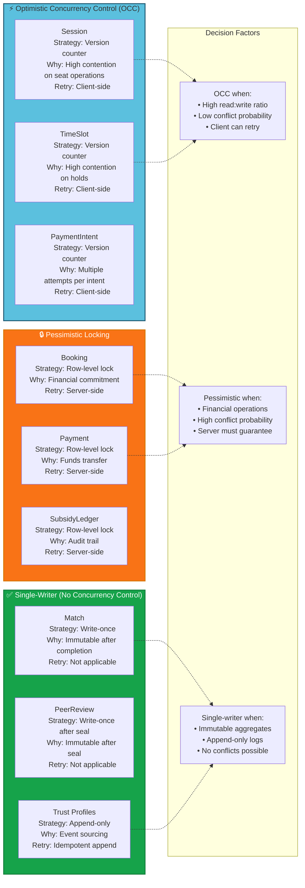

---

## E16 · Partition Key Strategy for Scalability

**Answers:** How are aggregates partitioned for horizontal scaling?
**Why it matters:** v8 added L18 (Partition key strategy) but no visualization.

```mermaid
flowchart TD
    subgraph USER_PARTITIONED["👤 User-Partitioned Aggregates"]
        UP1["Booking
        Partition: userId
        Why: User-centric queries
        Shard: Consistent hash"]
        
        UP2["Trust Profiles
        Partition: userId
        Why: User-centric queries
        Shard: Consistent hash"]
        
        UP3["PaymentIntent
        Partition: userId
        Why: User payment history
        Shard: Consistent hash"]
    end

    subgraph SESSION_PARTITIONED["🎮 Session-Partitioned Aggregates"]
        SP1["Session
        Partition: sessionId
        Why: Session-centric operations
        Shard: Consistent hash"]
        
        SP2["Match
        Partition: sessionId
        Why: Co-located with Session
        Shard: Consistent hash"]
        
        SP3["Seat (entity)
        Partition: sessionId
        Why: Within Session aggregate
        Shard: Consistent hash"]
    end

    subgraph TIME_PARTITIONED["📅 Time-Partitioned Aggregates"]
        TP1["TimeSlot
        Partition: date + venueId
        Why: Time-range queries
        Shard: Range-based"]
        
        TP2["SubsidyLedger
        Partition: date
        Why: Audit trail queries
        Shard: Range-based"]
        
        TP3["KarmaLedger
        Partition: date
        Why: Historical queries
        Shard: Range-based"]
    end

    subgraph COMPOSITE_PARTITIONED["🔀 Composite-Partitioned Aggregates"]
        CP1["PeerReview
        Partition: sessionId + userId
        Why: Session + user queries
        Shard: Composite hash"]
        
        CP2["CancellationCase
        Partition: targetId + initiatorId
        Why: Bilateral queries
        Shard: Composite hash"]
    end

    subgraph SCALING_PATTERNS["Scaling Patterns"]
        PAT1["User-partitioned:
        • Scales with user growth
        • Hot users = hot shards
        • Rebalance on growth"]
        
        PAT2["Session-partitioned:
        • Scales with sessions
        • Even distribution
        • No hot shards"]
        
        PAT3["Time-partitioned:
        • Scales with time
        • Archive old partitions
        • Predictable growth"]
        
        PAT4["Composite-partitioned:
        • Scales with both
        • Complex rebalancing
        • Use sparingly"]
    end

    UP1 -.-> PAT1
    SP1 -.-> PAT2
    TP1 -.-> PAT3
    CP1 -.-> PAT4

    style USER_PARTITIONED fill:#5BC0DE,stroke:#1F5A73,stroke-width:2px
    style SESSION_PARTITIONED fill:#16a34a,color:white,stroke:#15803d,stroke-width:2px
    style TIME_PARTITIONED fill:#f97316,color:white,stroke:#d97706,stroke-width:2px
    style COMPOSITE_PARTITIONED fill:#7c3aed,color:white,stroke:#5b21b6,stroke-width:2px
```

---

## E17 · Anti-Pattern Detection Checklist

**Answers:** What are the most common violations? How to detect them?
**Why it matters:** Codifies the "forbidden" patterns from the evolution journey.

```mermaid
flowchart TD
    subgraph TRUST_ANTIPATTERNS["❌ Trust Anti-Patterns (DG-1 Violations)"]
        TAP1["Composed TrustScore
        Detection: Column named 'reputation'
        Fix: Delete column, use policy"]
        
        TAP2["Cache-dependent decision
        Detection: Decision breaks on cache miss
        Fix: Make cache optional"]
        
        TAP3["Missing use_case parameter
        Detection: getReputation(userId)
        Fix: Add use_case parameter"]
    end

    subgraph HOST_ANTIPATTERNS["❌ Host Anti-Patterns (DG-2 Violations)"]
        HAP1["Host mutates coordination
        Detection: Host imports Coordination types
        Fix: Remove imports"]
        
        HAP2["Host in saga orchestration
        Detection: Host as saga step
        Fix: Use capability check only"]
        
        HAP3["Host triggers workflows
        Detection: Host emits non-capability events
        Fix: Emit capability events only"]
    end

    subgraph POLICY_ANTIPATTERNS["❌ Policy Anti-Patterns (DG-3 Violations)"]
        PAP1["Policy writes to DB
        Detection: Repository injection
        Fix: Return decision object"]
        
        PAP2["Policy calls external system
        Detection: HTTP client injection
        Fix: Pass data as input"]
        
        PAP3["Policy emits events
        Detection: Event publisher injection
        Fix: Return decision, caller emits"]
    end

    subgraph RECOVERY_ANTIPATTERNS["❌ Recovery Anti-Patterns (DG-4/5 Violations)"]
        RAP1["Aggregate emits *Cancelled
        Detection: Event name ends with 'Cancelled'
        Fix: Emit *DeviationRequested"]
        
        RAP2["Multiple emitters of canonical
        Detection: *Cancelled from non-Recovery
        Fix: Route through Recovery"]
        
        RAP3["Recovery bypassed
        Detection: Direct cancellation
        Fix: Always go through Recovery"]
    end

    subgraph DETECTION_TOOLS["🔍 Detection Tools"]
        DT1["Static analysis
        Lint rules for imports"]
        DT2["Architecture tests
        ArchUnit / NetArchTest"]
        DT3["Event schema validation
        Event naming conventions"]
        DT4["Code review checklist
        PR template"]
    end

    TAP1 --> DT1
    TAP2 --> DT2
    HAP1 --> DT1
    HAP2 --> DT2
    PAP1 --> DT1
    PAP2 --> DT1
    RAP1 --> DT3
    RAP2 --> DT3

    style TRUST_ANTIPATTERNS fill:#dc2626,color:white,stroke:#7A1F1C,stroke-width:2px
    style HOST_ANTIPATTERNS fill:#dc2626,color:white,stroke:#7A1F1C,stroke-width:2px
    style POLICY_ANTIPATTERNS fill:#dc2626,color:white,stroke:#7A1F1C,stroke-width:2px
    style RECOVERY_ANTIPATTERNS fill:#dc2626,color:white,stroke:#7A1F1C,stroke-width:2px
    style DETECTION_TOOLS fill:#16a34a,color:white,stroke:#15803d,stroke-width:2px
```

---

## Summary: What Makes These Diagrams "Richer"

### 1. **Evolution Context**
- E1 shows the journey, not just the destination
- Prevents regression to v6 anti-patterns
- Documents architectural breakthroughs

### 2. **Enforcement Relationships**
- E2 shows how guards enforce locked decisions
- Makes the dependency structure explicit
- Shows that guards aren't arbitrary

### 3. **Decision Logic**
- E3 shows trust composition decision trees
- Makes L4 + DG-1 concrete
- Shows use-case-specific logic

### 4. **Operational Reality**
- E6 shows on-call topology and deployment boundaries
- E8 shows staleness SLOs and user impact
- E9 shows failure blast radius and containment

### 5. **Scalability Strategies**
- E15 shows concurrency strategies per aggregate
- E16 shows partition key strategies
- E10 shows idempotency strategies

### 6. **Anti-Pattern Detection**
- E17 codifies forbidden patterns
- Shows detection tools
- Prevents drift

---

## Comparison: Existing vs. Enhanced Diagrams

| Existing Diagram | Enhancement | What's Added |
|------------------|-------------|--------------|
| D1 Subdomain Heatmap | E1 Evolution Timeline | Shows how we got here |
| D2 Context Map | E6 Service Block Topology | Shows on-call boundaries |
| D3 Trust Constellation | E3 Trust Decision Tree | Shows decision logic |
| D5 Aggregate Constellation | E4 Invariant Cross-Reference | Shows invariant dependencies |
| D9 Booking Saga | E5 Compensation Flow | Shows trust impact |
| D12 Read Model Projection | E8 Staleness SLO Matrix | Shows user impact |
| (Missing) | E9 Failure Blast Radius | Shows containment |
| (Missing) | E10 Idempotency Strategy | Shows de-dup logic |
| (Missing) | E12 Dispute Reversal | Shows observation reversal |
| (Missing) | E14 Orchestration vs. Choreography | Shows saga patterns |
| (Missing) | E15 Concurrency Strategy | Shows OCC vs. locking |
| (Missing) | E16 Partition Strategy | Shows scaling patterns |
| (Missing) | E17 Anti-Pattern Detection | Shows forbidden patterns |

---

## Recommended Reading Order

1. **E1 Evolution Timeline** — Understand the journey
2. **E2 Locked Decision Dependency** — Understand the enforcement structure
3. **E3 Trust Decision Tree** — Understand the most critical architectural decision
4. **E6 Service Block Topology** — Understand operational reality
5. **E9 Failure Blast Radius** — Understand failure isolation
6. **E5 Compensation Flow** — Understand saga compensation
7. **E17 Anti-Pattern Detection** — Understand forbidden patterns

---

## Next Steps

1. **Validate with stakeholders:** Review E1-E17 with architects and team leads
2. **Add to CI/CD:** Generate diagrams from workbook on every commit
3. **Architecture tests:** Implement E17 detection tools
4. **Onboarding:** Use E1-E3 for new architect onboarding
5. **Runbooks:** Use E9 for SRE runbooks

