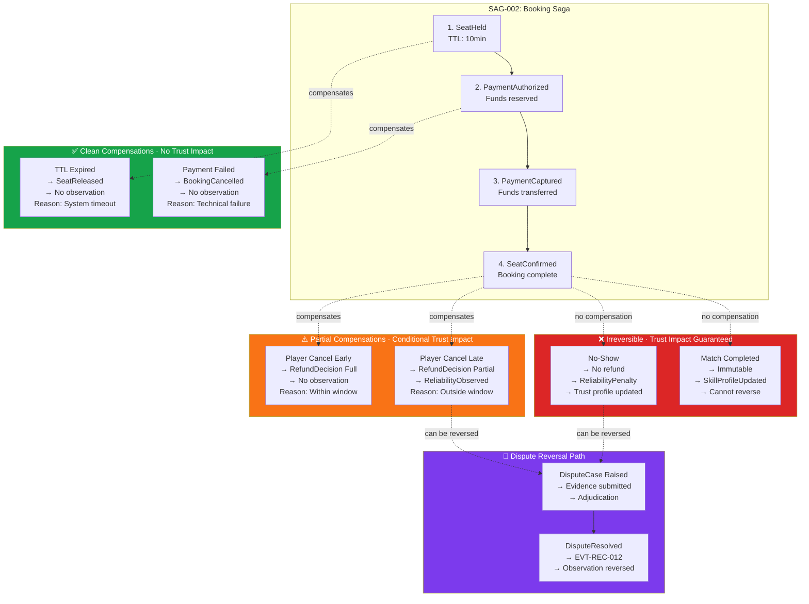
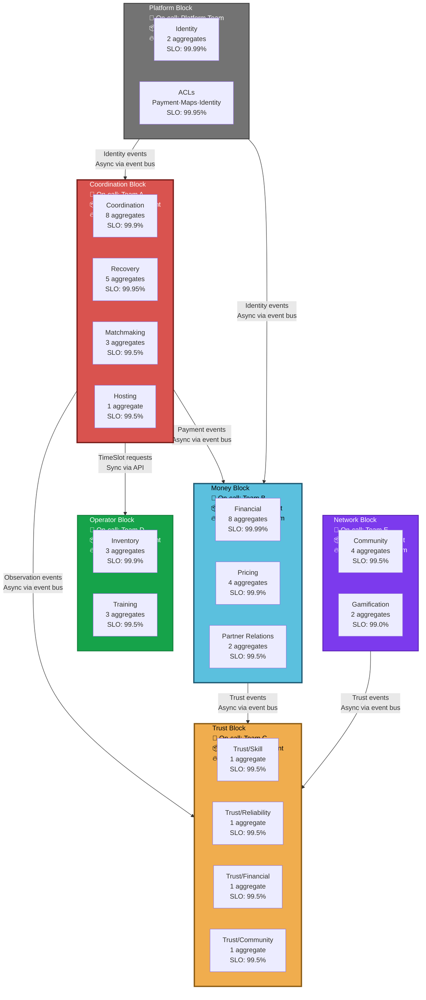
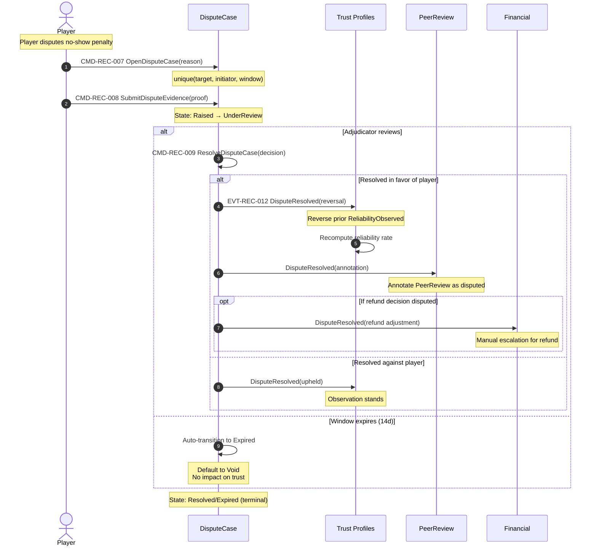

# Playo DDD Enhanced Diagram Suite

**Purpose:** This document extends the existing v7 and v8 diagrams with deeper architectural insights derived from understanding the domain model evolution from v6 → v6.1 → v7 → v8.

**Key Evolution Insights:**
- v6: Foundation (8 Locked Decisions, 10 BCs)
- v6.1: Trust split into 4 profiles (DG-1 enforcement)
- v7: Strategic expansion (Gamification, Community, Training)
- v8: Operational maturity (Service Blocks, Idempotency strategies)

---

## E1 · Domain Model Evolution Timeline

**Answers:** How did we get here? What were the key architectural breakthroughs?
**Why it matters:** Prevents regression to anti-patterns (like monolithic Trust). Documents the learning journey.

```mermaid
timeline
    title Domain Model Evolution Journey
    
    section v6 Foundation (2024 Q1)
        8 Locked Decisions : L1-L8 established core principles
        10 Bounded Contexts : Core/Supporting/Generic classification
        Monolithic Trust : Single TrustScore concept (recognized as problematic)
        Recovery Single Emitter : L1 locked - Recovery owns ALL deviations
        Capacity/Money Split : L2 locked - Async separation prevents deadlocks
        
    section v6.1 Tactical Refinement (2024 Q2)
        Trust Breakthrough : Split into 4 independent profiles (Skill, Reliability, Financial, Community)
        Design Guards : DG-1 to DG-7 formalized to enforce locked decisions
        Cell Demotion : Cell demoted from aggregate to projection (no invariants)
        Host Boundary : DG-2 enforces Host as capability provider only
        Policy Purity : DG-3 enforces stateless decision functions
        
    section v7 Strategic Expansion (2024 Q3)
        14 Bounded Contexts : Added Gamification, Community, Training, Matchmaking
        Matchmaking Core : Skill-based team balancing becomes core domain
        Dispute Resolution : Formalized with observation reversal capability
        13 Sagas : Complete choreography coverage
        Trust Composition : Explicit use-case bindings per decision
        
    section v8 Operational Maturity (2024 Q4)
        15 Bounded Contexts : Added SubsidyLedger within Recovery
        Service Blocks : Operational grouping for team topology
        Idempotency Strategies : L16-L19 per-aggregate guarantees
        Intent/Attempt/Payment : Financial split enables PSP failover
        Failure Blast Radius : DG-19 containment strategies
```



---

## E2 · Locked Decision Dependency Graph

**Answers:** Which design guards enforce which locked decisions? What's the dependency structure?
**Why it matters:** Shows that guards aren't arbitrary - they're enforcement mechanisms for architectural principles.

```mermaid
flowchart TD
    subgraph FOUNDATION[L1-L8: Foundation Locked Decisions]
        L1[L1: Recovery owns ALL deviations<br/>Single emitter of canonical failure events]
        L2[L2: Session owns capacity<br/>Booking owns financial commitment<br/>ASYNC separation]
        L3[L3: Policies are stateless<br/>No orchestration, no side effects]
        L4[L4: TrustScore = f(use_case, profiles)<br/>Use-case binding MANDATORY]
        L5[L5: Host provides capabilities<br/>Coordination owns assembly]
        L6[L6: Inventory = physical truth<br/>Partner = contractual truth]
        L7[L7: Build order<br/>Events → Aggregates → Policies → Workflows]
        L8[L8: Sheet = Layer<br/>Physical separation mirrors logical]
    end

    subgraph GUARDS[DG-1 to DG-7: Enforcement Guards]
        DG1[DG-1: Trust Composition Purity<br/>❌ NO persisted composed score<br/>❌ NO cache-dependent decisions<br/>✅ Use-case parameter REQUIRED]
        
        DG2[DG-2: Host Boundary<br/>❌ NO coordination state mutation<br/>❌ NO workflow triggering<br/>✅ Capability events ONLY]
        
        DG3[DG-3: Policy Purity<br/>❌ NO database writes<br/>❌ NO network calls<br/>❌ NO event emission<br/>✅ Pure decision functions]
        
        DG45[DG-4/5: Deviation Translation<br/>Aggregates emit *DeviationRequested<br/>Recovery emits canonical *Cancelled]
        
        DG6[DG-6: Value Object Immutability<br/>VOs are immutable after creation]
        
        DG7[DG-7: Aggregate Operation Isolation<br/>Commands 1:1 with aggregate methods]
    end

    subgraph OPERATIONAL[L9-L19: Operational Constraints]
        L9[L9: Booking 1:1 with Seat<br/>Strict cardinality]
        L10[L10: Recovery single emitter<br/>Canonical failure events]
        L14[L14: Replacement filter<br/>skill ∧ geo ∧ reliability]
        L15[L15: PeerReview sealing<br/>Reciprocal OR 14d]
        L16[L16: Idempotency strategy<br/>Per aggregate]
        L19[L19: Service block isolation<br/>No aggregate sharing]
    end

    %% Enforcement relationships
    L4 -->|enforced by| DG1
    L3 -->|enforced by| DG3
    L1 -->|enforced by| DG45
    L5 -->|enforced by| DG2
    
    %% Operational builds on foundation
    L1 --> L10
    L2 --> L9
    
    %% Guards enable operational
    DG1 -.->|enables| L14
    DG3 -.->|enables| L15

    style L1 fill:#dc2626,color:white,stroke:#7A1F1C,stroke-width:3px
    style L4 fill:#dc2626,color:white,stroke:#7A1F1C,stroke-width:3px
    style DG1 fill:#f97316,color:white,stroke:#d97706,stroke-width:2px
    style DG45 fill:#f97316,color:white,stroke:#d97706,stroke-width:2px
    style DG3 fill:#f97316,color:white,stroke:#d97706,stroke-width:2px
```

---

## E3 · Trust Composition Decision Tree (Enhanced)

**Answers:** How do different use cases compose different profile combinations? What's the decision logic?
**Why it matters:** Makes L4 + DG-1 concrete. Shows that trust is NEVER a single number.

```mermaid
flowchart TD
    subgraph PROFILES[4 Trust Profiles · Append-Only · Never Composed]
        SKILL[SkillProfile<br/>📊 mu/sigma per sport<br/>Source: MatchCompleted, PeerReviewRevealed]
        REL[ReliabilityProfile<br/>📈 attendance rate, sample size<br/>Source: CheckInRecorded, NoShowCaseOpened]
        FIN[FinancialTrustProfile<br/>💰 payment discipline, BNPL rate<br/>Source: PaymentCaptured, BNPLDefaulted]
        COMM[CommunityStanding<br/>👥 peer aggregate, connections<br/>Source: PeerReviewRevealed, PlayPalConfirmed]
    end

    subgraph UC1[Use Case 1: Matchmaking Eligibility]
        MM_INPUT[Inputs: Skill + Reliability]
        MM_LOGIC{Decision Logic<br/>skill.mu in range?<br/>reliability.rate > threshold?}
        MM_OUTPUT[Output: Eligible / Ineligible<br/>+ confidence score]
    end

    subgraph UC2[Use Case 2: BNPL Eligibility]
        BNPL_INPUT[Inputs: Financial + Reliability]
        BNPL_LOGIC{Decision Logic<br/>payment discipline > 0.9?<br/>BNPL default rate < 0.05?<br/>reliability.rate > 0.8?}
        BNPL_OUTPUT[Output: Allow / Deny / RequireDeposit<br/>+ credit limit]
    end

    subgraph UC3[Use Case 3: Replacement Candidacy]
        REPL_INPUT[Inputs: Skill + Reliability + Geo]
        REPL_LOGIC{Decision Logic<br/>skill match?<br/>reliability > 0.85?<br/>geo distance < 5km?<br/>no conflict with session?}
        REPL_OUTPUT[Output: Ranked candidate list<br/>+ subsidy eligibility]
    end

    subgraph UC4[Use Case 4: Host Delegation]
        HOST_INPUT[Inputs: Reliability + Community]
        HOST_LOGIC{Decision Logic<br/>reliability > 0.9?<br/>community standing > threshold?<br/>completion history > 20?}
        HOST_OUTPUT[Output: Qualified / NotQualified<br/>+ delegation level]
    end

    subgraph UC5[Use Case 5: Review Display]
        DISP_INPUT[Inputs: Community + Skill]
        DISP_LOGIC{Decision Logic<br/>peer aggregate credible?<br/>skill verified?<br/>dispute history?}
        DISP_OUTPUT[Output: Display / Hide / Annotate<br/>+ credibility badge]
    end

    SKILL --> MM_INPUT
    REL --> MM_INPUT
    MM_INPUT --> MM_LOGIC
    MM_LOGIC --> MM_OUTPUT

    FIN --> BNPL_INPUT
    REL --> BNPL_INPUT
    BNPL_INPUT --> BNPL_LOGIC
    BNPL_LOGIC --> BNPL_OUTPUT

    SKILL --> REPL_INPUT
    REL --> REPL_INPUT
    REPL_INPUT --> REPL_LOGIC
    REPL_LOGIC --> REPL_OUTPUT

    REL --> HOST_INPUT
    COMM --> HOST_INPUT
    HOST_INPUT --> HOST_LOGIC
    HOST_LOGIC --> HOST_OUTPUT

    COMM --> DISP_INPUT
    SKILL --> DISP_INPUT
    DISP_INPUT --> DISP_LOGIC
    DISP_LOGIC --> DISP_OUTPUT

    FORBIDDEN[❌ FORBIDDEN<br/>NO getReputation(userId)<br/>NO single composed score<br/>NO cache-dependent decisions<br/>DG-1 VIOLATION]

    SKILL -.->|❌| FORBIDDEN
    REL -.->|❌| FORBIDDEN
    FIN -.->|❌| FORBIDDEN
    COMM -.->|❌| FORBIDDEN

    style PROFILES fill:#F0AD4E,stroke:#8A5A12,stroke-width:2px
    style FORBIDDEN fill:#ef4444,color:white,stroke:#7A1F1C,stroke-width:3px
    style MM_LOGIC fill:#5BC0DE,stroke:#1F5A73
    style BNPL_LOGIC fill:#5BC0DE,stroke:#1F5A73
    style REPL_LOGIC fill:#5BC0DE,stroke:#1F5A73
    style HOST_LOGIC fill:#5BC0DE,stroke:#1F5A73
    style DISP_LOGIC fill:#5BC0DE,stroke:#1F5A73
```

---

## E4 · Aggregate Invariant Cross-Reference Matrix

**Answers:** Which invariants are shared? Which locked decisions enforce which invariants?
**Why it matters:** Shows the "blast radius" of invariant violations.

```mermaid
flowchart LR
    subgraph INVARIANTS[Critical Invariants]
        INV1[INV-COR-002<br/>held + confirmed ≤ capacity<br/>NEVER violated]
        INV2[INV-COR-006<br/>Booking 1:1 with Seat<br/>unique(session, user)]
        INV3[INV-COR-004<br/>Match immutable after completion<br/>Write-once]
        INV4[INV-COM-005<br/>PeerReview immutable after Seal<br/>Content locked]
        INV5[INV-TRUST-001<br/>No composed TrustScore<br/>Use-case binding required]
        INV6[INV-REC-003<br/>Recovery single emitter<br/>Canonical events only]
        INV7[INV-FIN-003<br/>Intent → Attempt → Payment<br/>Retry without losing Intent]
    end

    subgraph AGGREGATES[Aggregates Enforcing]
        SESSION[Session<br/>Atomic counters + OCC]
        BOOKING[Booking<br/>Unique constraint]
        MATCH[Match<br/>Immutable after event]
        PEER[PeerReview<br/>Sealed state]
        TRUST[Trust Profiles<br/>Append-only]
        RECOVERY[Recovery Cases<br/>Deviation lifecycle]
        PAYMENT[PaymentIntent<br/>State machine]
    end

    subgraph LOCKED[Enforced By Locked Decisions]
        L2[L2: Capacity/Money async<br/>Prevents deadlocks]
        L9[L9: Booking 1:1 Seat<br/>Strict cardinality]
        L4[L4: Trust use-case bound<br/>No generic reputation]
        L15[L15: PeerReview sealing<br/>Reciprocal OR 14d]
        L1[L1: Recovery owns deviations<br/>Single emitter]
        L10[L10: Canonical events<br/>Recovery only]
    end

    subgraph GUARDS[Enforced By Design Guards]
        DG1[DG-1: Trust Composition Purity]
        DG45[DG-4/5: Deviation Translation]
    end

    INV1 --> SESSION
    INV2 --> BOOKING
    INV3 --> MATCH
    INV4 --> PEER
    INV5 --> TRUST
    INV6 --> RECOVERY
    INV7 --> PAYMENT

    L2 -.->|enforces| INV1
    L9 -.->|enforces| INV2
    L4 -.->|enforces| INV5
    L15 -.->|enforces| INV4
    L1 -.->|enforces| INV6
    L10 -.->|enforces| INV6

    DG1 -.->|enforces| INV5
    DG45 -.->|enforces| INV6

    style INV1 fill:#dc2626,color:white
    style INV5 fill:#dc2626,color:white
    style INV6 fill:#dc2626,color:white
    style L2 fill:#f97316,color:white
    style L4 fill:#f97316,color:white
    style L1 fill:#f97316,color:white
```

---

## E5 · Saga Compensation Flow Matrix

**Answers:** What can be rolled back vs. what's irreversible? How do compensations affect trust?
**Why it matters:** Shows the "compensation budget" and trust observation lifecycle.



---


## E6 · Service Block On-Call Topology (Enhanced)

**Answers:** Who's on-call for what? What are the deployment boundaries? How do failures isolate?
**Why it matters:** v8 introduced Service Blocks but didn't show operational reality.



---

## E7 · Event Storming Big Picture (Multi-Timeline)

**Answers:** What's the full temporal grain across all major flows?
**Why it matters:** Current D8 shows only Game-to-Match. This shows parallel flows.

```mermaid
timeline
    title Event Storming Big Picture - All Major Flows
    
    section Flow 1: Game Creation → Match
        GameProposed : User intent
        GameOpened : Accepts joiners
        SeatHeld : User reserves (TTL)
        PaymentCaptured : Funds transferred
        SeatConfirmed : Booking complete
        SessionScheduled : Venue + time locked
        MatchStarted : Physical play begins
        MatchCompleted : Post-event truth
        
    section Flow 2: Cancellation Cascade
        BookingDeviationRequested : Player cancels
        CancellationCaseOpened : Recovery owns
        RefundEligibilityEvaluated : Policy decision
        RefundIssued : Financial executes
        BookingCancelled : Canonical event (L1)
        SeatReleased : Capacity freed
        ReliabilityObserved : Trust signal
        
    section Flow 3: Replacement Search
        ReplacementCaseOpened : Seat vacated
        CandidatesRanked : Matchmaking filters
        CandidatesNotified : Push/SMS/email
        ReplacementFound : First confirmer
        SubsidyDecisionMade : Subsidy applied
        SubsidyLedgerAppended : Recorded
        
    section Flow 4: No-Show Detection
        MatchStarted : Attendance check
        NoShowCaseOpened : Missing player
        ReliabilityPenaltyApplied : Trust penalty
        ReliabilityProfileUpdated : Profile updated
        
    section Flow 5: Dispute Resolution
        DisputeCaseRaised : Player disputes
        DisputeEvidenceSubmitted : Evidence
        DisputeCaseResolved : Adjudication
        ObservationReversed : Trust reversed (EVT-REC-012)
        PeerReviewAnnotated : Review marked
        
    section Flow 6: BNPL Default
        BNPLObligationCreated : Buy-now-pay-later
        BNPLPaymentMissed : Payment missed
        BNPLDefaultRequested : Deviation
        BNPLDefaultCaseOpened : Recovery owns
        BNPLDefaulted : Canonical event
        FinancialTrustObserved : Trust penalty
```

---

## E8 · Read Model Staleness SLO Matrix

**Answers:** What's the staleness budget per projection? What's the user-facing impact?
**Why it matters:** Makes eventual consistency concrete and measurable.

```mermaid
flowchart LR
    subgraph PROJECTIONS[Read Models with Staleness SLOs]
        GF[Game Feed<br/>📊 SLO: 30s eventual<br/>💥 Impact: Discovery delay<br/>🔄 Invalidation: GameProposed/Opened]
        
        SD[Session Details<br/>📊 SLO: 5s eventual<br/>💥 Impact: Booking confusion<br/>🔄 Invalidation: SeatHeld/Confirmed]
        
        UP[User Profile<br/>📊 SLO: 10s eventual<br/>💥 Impact: History delay<br/>🔄 Invalidation: MatchCompleted]
        
        LB[Leaderboard<br/>📊 SLO: 5min eventual<br/>💥 Impact: Low (gamification)<br/>🔄 Invalidation: KarmaAwarded]
        
        VC[Venue Catalog<br/>📊 SLO: 1h eventual<br/>💥 Impact: Low (browse)<br/>🔄 Invalidation: VenueOnboarded]
        
        DF[Demand Forecast<br/>📊 SLO: 15min eventual<br/>💥 Impact: Internal only<br/>🔄 Invalidation: Booking patterns]
    end

    subgraph EVENTS[Source Events]
        E1[GameProposed<br/>GameOpened<br/>GameClosed]
        E2[SessionScheduled<br/>SeatHeld<br/>SeatConfirmed]
        E3[MatchCompleted<br/>TrustProfileUpdated]
        E4[KarmaAwarded<br/>AchievementUnlocked]
        E5[VenueOnboarded<br/>PartnerKYCCompleted]
        E6[BookingCreated<br/>BookingConfirmed<br/>Historical patterns]
    end

    subgraph CACHE[Cache Strategy]
        CACHE1[Write-through<br/>Immediate invalidation]
        CACHE2[Write-behind<br/>Async invalidation]
        CACHE3[TTL-based<br/>Periodic refresh]
    end

    E1 --> GF
    E2 --> SD
    E3 --> UP
    E4 --> LB
    E5 --> VC
    E6 --> DF

    GF --> CACHE1
    SD --> CACHE1
    UP --> CACHE2
    LB --> CACHE3
    VC --> CACHE3
    DF --> CACHE3

    style GF fill:#dc2626,color:white
    style SD fill:#dc2626,color:white
    style UP fill:#f97316,color:white
    style LB fill:#16a34a,color:white
    style VC fill:#16a34a,color:white
    style DF fill:#16a34a,color:white
```

---

## E9 · Failure Mode Blast Radius Diagram

**Answers:** What's the blast radius of each failure? Which saga contains it?
**Why it matters:** Shows failure isolation boundaries and recovery strategies.


---

## E10 · Idempotency Key Strategy Diagram

**Answers:** Which operations use which idempotency keys? Time-bounded vs. forever-unique?
**Why it matters:** v8 added L16 (Idempotency strategy per aggregate) but no visualization.

```mermaid
flowchart LR
    subgraph TIME_BOUNDED[⏱️ Time-Bounded Idempotency]
        O1[HoldSeat<br/>Key: sessionId+userId+seatHoldId<br/>Window: TTL (10min)<br/>Reason: Seat hold expires]
        
        O2[BeginPaymentAttempt<br/>Key: intentId+attemptId<br/>Window: Intent lifecycle<br/>Reason: Retry window]
    end

    subgraph FOREVER[♾️ Forever-Unique Idempotency]
        O3[CreateBooking<br/>Key: sessionId+userId<br/>Window: Forever<br/>Reason: Unique constraint]
        
        O4[CreatePaymentIntent<br/>Key: bookingId<br/>Window: Forever<br/>Reason: 1:1 with booking]
        
        O5[CapturePayment<br/>Key: pgRef<br/>Window: Forever<br/>Reason: External system ref]
        
        O6[EmitCanonicalCancellation<br/>Key: caseId<br/>Window: Forever<br/>Reason: Single emission (L1)]
        
        O7[AppendSubsidyLedger<br/>Key: replacementCaseId<br/>Window: Forever<br/>Reason: Audit trail]
    end

    subgraph AGGREGATE_BOUNDED[🔒 Aggregate-Bounded Idempotency]
        O8[ConfirmSeat<br/>Key: sessionId+userId<br/>Window: Session lifecycle<br/>Reason: Tied to aggregate]
        
        O9[SealPeerReview<br/>Key: reviewId<br/>Window: Review lifecycle<br/>Reason: Immutable after seal]
    end

    subgraph STRATEGIES[De-dup Strategy]
        S1[TTL-based expiry<br/>Cleanup after window]
        S2[Never expires<br/>Permanent record]
        S3[Aggregate lifecycle<br/>Cleanup on aggregate delete]
    end

    O1 --> S1
    O2 --> S1
    O3 --> S2
    O4 --> S2
    O5 --> S2
    O6 --> S2
    O7 --> S2
    O8 --> S3
    O9 --> S3

    style TIME_BOUNDED fill:#f97316,color:white,stroke:#d97706,stroke-width:2px
    style FOREVER fill:#16a34a,color:white,stroke:#15803d,stroke-width:2px
    style AGGREGATE_BOUNDED fill:#5BC0DE,stroke:#1F5A73,stroke-width:2px
```

---

## E11 · PeerReview Sealing Window Visualization

**Answers:** How does the sealing window work? When does reveal happen?
**Why it matters:** L15 (PeerReview sealing) is time-based but not visualized.

```mermaid
gantt
    title PeerReview Sealing Window (L15 Enforcement)
    dateFormat X
    axisFormat %H:%M

    section Player A Reviews Player B
    Draft review    :a1, 0, 3600000
    Seal review     :milestone, a2, 3600000, 0

    section Player B Reviews Player A
    Draft review    :b1, 0, 1800000
    Seal review     :milestone, b2, 1800000, 0

    section Reveal Logic
    Reciprocal seal triggers reveal :milestone, m1, 3600000, 0
    OR 14d expiry (if no reciprocal) :milestone, m2, 1209600000, 0

    section After Reveal
    Content immutable :crit, r1, 3600000, 1209600000
    Annotation via Dispute only :crit, r2, 3600000, 1209600000
```



**Key Rules (L15):**
1. Content IMMUTABLE after Seal
2. Reveal = earlier of (reciprocal seal OR session.end + 14d)
3. After Reveal, only DisputeResolved can annotate
4. Prevents retaliatory rating

---

## E12 · Dispute Resolution Reversal Flow

**Answers:** How does DisputeCase reverse prior trust observations?
**Why it matters:** v8 added EVT-REC-012 (observation reversal) but no visualization.



**Key Insights:**
- DisputeResolved is the ONLY way to reverse a trust observation
- Reversal is explicit via EVT-REC-012
- PeerReview gets annotated, not deleted
- Refund adjustments require manual escalation

---


## E13 · Value Object Shared Kernel Heatmap

**Answers:** Which VOs are used by 3+ BCs? What's the shared kernel risk?
**Why it matters:** High-reuse VOs need extra design care (DG-6).

```mermaid
flowchart TD
    subgraph HIGH_REUSE[🔥 High Reuse VOs (3+ BCs) - Shared Kernel Candidates]
        MONEY[Money<br/>VO-04<br/>Currency + amount<br/>Used by: Financial, Pricing, Booking, Partner<br/>Reuse: 4 BCs]
        
        TIMEWINDOW[TimeWindow<br/>VO-02<br/>Start/end validation<br/>Used by: Coordination, Inventory, Training<br/>Reuse: 3 BCs]
        
        GEO[Geo<br/>VO-06<br/>Lat/lng validation<br/>Used by: Inventory, Community, Training<br/>Reuse: 3 BCs]
        
        SPORT[Sport<br/>VO-01<br/>Enum validation<br/>Used by: Coordination, Inventory, Training<br/>Reuse: 3 BCs]
    end

    subgraph MEDIUM_REUSE[⚠️ Medium Reuse VOs (2 BCs)]
        SKILL_RANGE[SkillRange<br/>VO-07<br/>Min/max validation<br/>Used by: Coordination, Trust/Skill<br/>Reuse: 2 BCs]
        
        LOCATION[Location<br/>VO-03<br/>Address + geo<br/>Used by: Coordination, Inventory<br/>Reuse: 2 BCs]
        
        BOOKING_STATUS[BookingStatus<br/>VO-08<br/>State enum<br/>Used by: Coordination, Financial<br/>Reuse: 2 BCs]
        
        COMMISSION_RATE[CommissionRate<br/>VO-11<br/>Percentage validation<br/>Used by: Pricing, Partner<br/>Reuse: 2 BCs]
    end

    subgraph SINGLE_USE[✅ Single-Use VOs (1 BC)]
        SESSION_STATUS[SessionStatus<br/>VO-05<br/>State enum<br/>Used by: Coordination only]
        
        PAYMENT_STATUS[PaymentStatus<br/>VO-09<br/>State enum<br/>Used by: Financial only]
        
        TRUST_SCORE[TrustScore<br/>VO-10<br/>0-100 validation<br/>Used by: All 4 Trust BCs<br/>BUT: Never composed (DG-1)]
    end

    subgraph DESIGN_CARE[Design Care Required]
        DC1[Immutability enforcement<br/>DG-6]
        DC2[Versioning strategy<br/>Breaking changes]
        DC3[Validation consistency<br/>Across BCs]
        DC4[Serialization format<br/>Wire compatibility]
    end

    MONEY --> DC1
    MONEY --> DC2
    MONEY --> DC3
    MONEY --> DC4

    TIMEWINDOW --> DC1
    TIMEWINDOW --> DC3

    GEO --> DC1
    GEO --> DC3

    SPORT --> DC1
    SPORT --> DC2

    style HIGH_REUSE fill:#dc2626,color:white,stroke:#7A1F1C,stroke-width:3px
    style MEDIUM_REUSE fill:#f97316,color:white,stroke:#d97706,stroke-width:2px
    style SINGLE_USE fill:#16a34a,color:white,stroke:#15803d,stroke-width:2px
    style DESIGN_CARE fill:#7c3aed,color:white,stroke:#5b21b6,stroke-width:2px
```

---

## E14 · Saga Orchestration vs. Choreography Decision Matrix

**Answers:** Which sagas are orchestrated vs. choreographed? Why?
**Why it matters:** Shows the architectural trade-offs in saga design.

```mermaid
flowchart TD
    subgraph ORCHESTRATED[🎯 Orchestrated Sagas (Explicit Coordinator)]
        O1[SAG-001: Game-to-Session<br/>Orchestrator: Coordination<br/>Why: Complex state machine<br/>Participants: Inventory, Pricing]
        
        O2[SAG-002: Booking<br/>Orchestrator: Coordination<br/>Why: Financial commitment<br/>Participants: Financial, Recovery]
        
        O3[SAG-003: Player Cancel<br/>Orchestrator: Recovery<br/>Why: Deviation lifecycle<br/>Participants: Financial, Trust]
        
        O4[SAG-004: Replacement<br/>Orchestrator: Recovery<br/>Why: Multi-step search<br/>Participants: Matchmaking, Coordination]
        
        O5[SAG-011: Waitlist Promote<br/>Orchestrator: Coordination<br/>Why: Seat allocation<br/>Participants: Financial]
    end

    subgraph CHOREOGRAPHED[💃 Choreographed Sagas (Event-Driven)]
        C1[SAG-007: Gamification<br/>Trigger: MatchCompleted<br/>Why: Low coupling<br/>Consumers: Gamification, Community]
        
        C2[SAG-009: Community→Trust<br/>Trigger: PeerReviewRevealed<br/>Why: Observation pattern<br/>Consumers: Trust profiles]
        
        C3[SAG-008: Yield/Subsidy<br/>Trigger: Cell thinness<br/>Why: Policy-driven<br/>Consumers: Pricing]
    end

    subgraph HYBRID[🔀 Hybrid Sagas (Mixed Pattern)]
        H1[SAG-005: Host Cancel<br/>Orchestrator: Recovery<br/>Choreography: Cascade to bookings<br/>Why: Deviation + broadcast]
        
        H2[SAG-006: Venue Cancel<br/>Orchestrator: Recovery<br/>Choreography: Cascade to bookings<br/>Why: Deviation + broadcast]
        
        H3[SAG-013: Dispute<br/>Orchestrator: Recovery<br/>Choreography: Observation reversal<br/>Why: Adjudication + broadcast]
    end

    subgraph DECISION_FACTORS[Decision Factors]
        DF1[Orchestration when:<br/>• Complex compensation<br/>• Financial commitment<br/>• Multi-step coordination]
        
        DF2[Choreography when:<br/>• Low coupling desired<br/>• Observation pattern<br/>• Broadcast to many]
        
        DF3[Hybrid when:<br/>• Deviation + cascade<br/>• Adjudication + broadcast<br/>• Mixed concerns]
    end

    O1 -.-> DF1
    O2 -.-> DF1
    C1 -.-> DF2
    C2 -.-> DF2
    H1 -.-> DF3
    H2 -.-> DF3

    style ORCHESTRATED fill:#5BC0DE,stroke:#1F5A73,stroke-width:2px
    style CHOREOGRAPHED fill:#16a34a,color:white,stroke:#15803d,stroke-width:2px
    style HYBRID fill:#f97316,color:white,stroke:#d97706,stroke-width:2px
```

---

## E15 · Concurrency Strategy Per Aggregate

**Answers:** Which aggregates use OCC vs. pessimistic locking? Why?
**Why it matters:** v8 added L17 (Concurrency strategy per aggregate) but no visualization.

```mermaid
flowchart LR
    subgraph OCC[⚡ Optimistic Concurrency Control (OCC)]
        OCC1[Session<br/>Strategy: Version counter<br/>Why: High contention on seat operations<br/>Retry: Client-side]
        
        OCC2[TimeSlot<br/>Strategy: Version counter<br/>Why: High contention on holds<br/>Retry: Client-side]
        
        OCC3[PaymentIntent<br/>Strategy: Version counter<br/>Why: Multiple attempts per intent<br/>Retry: Client-side]
    end

    subgraph PESSIMISTIC[🔒 Pessimistic Locking]
        PESS1[Booking<br/>Strategy: Row-level lock<br/>Why: Financial commitment<br/>Retry: Server-side]
        
        PESS2[Payment<br/>Strategy: Row-level lock<br/>Why: Funds transfer<br/>Retry: Server-side]
        
        PESS3[SubsidyLedger<br/>Strategy: Row-level lock<br/>Why: Audit trail<br/>Retry: Server-side]
    end

    subgraph SINGLE_WRITER[✅ Single-Writer (No Concurrency Control)]
        SW1[Match<br/>Strategy: Write-once<br/>Why: Immutable after completion<br/>Retry: Not applicable]
        
        SW2[PeerReview<br/>Strategy: Write-once after seal<br/>Why: Immutable after seal<br/>Retry: Not applicable]
        
        SW3[Trust Profiles<br/>Strategy: Append-only<br/>Why: Event sourcing<br/>Retry: Idempotent append]
    end

    subgraph DECISION_FACTORS[Decision Factors]
        DF1[OCC when:<br/>• High read:write ratio<br/>• Low conflict probability<br/>• Client can retry]
        
        DF2[Pessimistic when:<br/>• Financial operations<br/>• High conflict probability<br/>• Server must guarantee]
        
        DF3[Single-writer when:<br/>• Immutable aggregates<br/>• Append-only logs<br/>• No conflicts possible]
    end

    OCC1 -.-> DF1
    OCC2 -.-> DF1
    PESS1 -.-> DF2
    PESS2 -.-> DF2
    SW1 -.-> DF3
    SW3 -.-> DF3

    style OCC fill:#5BC0DE,stroke:#1F5A73,stroke-width:2px
    style PESSIMISTIC fill:#f97316,color:white,stroke:#d97706,stroke-width:2px
    style SINGLE_WRITER fill:#16a34a,color:white,stroke:#15803d,stroke-width:2px
```

---

## E16 · Partition Key Strategy for Scalability

**Answers:** How are aggregates partitioned for horizontal scaling?
**Why it matters:** v8 added L18 (Partition key strategy) but no visualization.

```mermaid
flowchart TD
    subgraph USER_PARTITIONED[👤 User-Partitioned Aggregates]
        UP1[Booking<br/>Partition: userId<br/>Why: User-centric queries<br/>Shard: Consistent hash]
        
        UP2[Trust Profiles<br/>Partition: userId<br/>Why: User-centric queries<br/>Shard: Consistent hash]
        
        UP3[PaymentIntent<br/>Partition: userId<br/>Why: User payment history<br/>Shard: Consistent hash]
    end

    subgraph SESSION_PARTITIONED[🎮 Session-Partitioned Aggregates]
        SP1[Session<br/>Partition: sessionId<br/>Why: Session-centric operations<br/>Shard: Consistent hash]
        
        SP2[Match<br/>Partition: sessionId<br/>Why: Co-located with Session<br/>Shard: Consistent hash]
        
        SP3[Seat (entity)<br/>Partition: sessionId<br/>Why: Within Session aggregate<br/>Shard: Consistent hash]
    end

    subgraph TIME_PARTITIONED[📅 Time-Partitioned Aggregates]
        TP1[TimeSlot<br/>Partition: date + venueId<br/>Why: Time-range queries<br/>Shard: Range-based]
        
        TP2[SubsidyLedger<br/>Partition: date<br/>Why: Audit trail queries<br/>Shard: Range-based]
        
        TP3[KarmaLedger<br/>Partition: date<br/>Why: Historical queries<br/>Shard: Range-based]
    end

    subgraph COMPOSITE_PARTITIONED[🔀 Composite-Partitioned Aggregates]
        CP1[PeerReview<br/>Partition: sessionId + userId<br/>Why: Session + user queries<br/>Shard: Composite hash]
        
        CP2[CancellationCase<br/>Partition: targetId + initiatorId<br/>Why: Bilateral queries<br/>Shard: Composite hash]
    end

    subgraph SCALING_PATTERNS[Scaling Patterns]
        PAT1[User-partitioned:<br/>• Scales with user growth<br/>• Hot users = hot shards<br/>• Rebalance on growth]
        
        PAT2[Session-partitioned:<br/>• Scales with sessions<br/>• Even distribution<br/>• No hot shards]
        
        PAT3[Time-partitioned:<br/>• Scales with time<br/>• Archive old partitions<br/>• Predictable growth]
        
        PAT4[Composite-partitioned:<br/>• Scales with both<br/>• Complex rebalancing<br/>• Use sparingly]
    end

    UP1 -.-> PAT1
    SP1 -.-> PAT2
    TP1 -.-> PAT3
    CP1 -.-> PAT4

    style USER_PARTITIONED fill:#5BC0DE,stroke:#1F5A73,stroke-width:2px
    style SESSION_PARTITIONED fill:#16a34a,color:white,stroke:#15803d,stroke-width:2px
    style TIME_PARTITIONED fill:#f97316,color:white,stroke:#d97706,stroke-width:2px
    style COMPOSITE_PARTITIONED fill:#7c3aed,color:white,stroke:#5b21b6,stroke-width:2px
```

---

## E17 · Anti-Pattern Detection Checklist

**Answers:** What are the most common violations? How to detect them?
**Why it matters:** Codifies the "forbidden" patterns from the evolution journey.

```mermaid
flowchart TD
    subgraph TRUST_ANTIPATTERNS[❌ Trust Anti-Patterns (DG-1 Violations)]
        TAP1[Composed TrustScore<br/>Detection: Column named 'reputation'<br/>Fix: Delete column, use policy]
        
        TAP2[Cache-dependent decision<br/>Detection: Decision breaks on cache miss<br/>Fix: Make cache optional]
        
        TAP3[Missing use_case parameter<br/>Detection: getReputation(userId)<br/>Fix: Add use_case parameter]
    end

    subgraph HOST_ANTIPATTERNS[❌ Host Anti-Patterns (DG-2 Violations)]
        HAP1[Host mutates coordination<br/>Detection: Host imports Coordination types<br/>Fix: Remove imports]
        
        HAP2[Host in saga orchestration<br/>Detection: Host as saga step<br/>Fix: Use capability check only]
        
        HAP3[Host triggers workflows<br/>Detection: Host emits non-capability events<br/>Fix: Emit capability events only]
    end

    subgraph POLICY_ANTIPATTERNS[❌ Policy Anti-Patterns (DG-3 Violations)]
        PAP1[Policy writes to DB<br/>Detection: Repository injection<br/>Fix: Return decision object]
        
        PAP2[Policy calls external system<br/>Detection: HTTP client injection<br/>Fix: Pass data as input]
        
        PAP3[Policy emits events<br/>Detection: Event publisher injection<br/>Fix: Return decision, caller emits]
    end

    subgraph RECOVERY_ANTIPATTERNS[❌ Recovery Anti-Patterns (DG-4/5 Violations)]
        RAP1[Aggregate emits *Cancelled<br/>Detection: Event name ends with 'Cancelled'<br/>Fix: Emit *DeviationRequested]
        
        RAP2[Multiple emitters of canonical<br/>Detection: *Cancelled from non-Recovery<br/>Fix: Route through Recovery]
        
        RAP3[Recovery bypassed<br/>Detection: Direct cancellation<br/>Fix: Always go through Recovery]
    end

    subgraph DETECTION_TOOLS[🔍 Detection Tools]
        DT1[Static analysis<br/>Lint rules for imports]
        DT2[Architecture tests<br/>ArchUnit / NetArchTest]
        DT3[Event schema validation<br/>Event naming conventions]
        DT4[Code review checklist<br/>PR template]
    end

    TAP1 --> DT1
    TAP2 --> DT2
    HAP1 --> DT1
    HAP2 --> DT2
    PAP1 --> DT1
    PAP2 --> DT1
    RAP1 --> DT3
    RAP2 --> DT3

    style TRUST_ANTIPATTERNS fill:#dc2626,color:white,stroke:#7A1F1C,stroke-width:2px
    style HOST_ANTIPATTERNS fill:#dc2626,color:white,stroke:#7A1F1C,stroke-width:2px
    style POLICY_ANTIPATTERNS fill:#dc2626,color:white,stroke:#7A1F1C,stroke-width:2px
    style RECOVERY_ANTIPATTERNS fill:#dc2626,color:white,stroke:#7A1F1C,stroke-width:2px
    style DETECTION_TOOLS fill:#16a34a,color:white,stroke:#15803d,stroke-width:2px
```

---

## Summary: What Makes These Diagrams "Richer"

### 1. **Evolution Context**
- E1 shows the journey, not just the destination
- Prevents regression to v6 anti-patterns
- Documents architectural breakthroughs

### 2. **Enforcement Relationships**
- E2 shows how guards enforce locked decisions
- Makes the dependency structure explicit
- Shows that guards aren't arbitrary

### 3. **Decision Logic**
- E3 shows trust composition decision trees
- Makes L4 + DG-1 concrete
- Shows use-case-specific logic

### 4. **Operational Reality**
- E6 shows on-call topology and deployment boundaries
- E8 shows staleness SLOs and user impact
- E9 shows failure blast radius and containment

### 5. **Scalability Strategies**
- E15 shows concurrency strategies per aggregate
- E16 shows partition key strategies
- E10 shows idempotency strategies

### 6. **Anti-Pattern Detection**
- E17 codifies forbidden patterns
- Shows detection tools
- Prevents drift

---

## Comparison: Existing vs. Enhanced Diagrams

| Existing Diagram | Enhancement | What's Added |
|------------------|-------------|--------------|
| D1 Subdomain Heatmap | E1 Evolution Timeline | Shows how we got here |
| D2 Context Map | E6 Service Block Topology | Shows on-call boundaries |
| D3 Trust Constellation | E3 Trust Decision Tree | Shows decision logic |
| D5 Aggregate Constellation | E4 Invariant Cross-Reference | Shows invariant dependencies |
| D9 Booking Saga | E5 Compensation Flow | Shows trust impact |
| D12 Read Model Projection | E8 Staleness SLO Matrix | Shows user impact |
| (Missing) | E9 Failure Blast Radius | Shows containment |
| (Missing) | E10 Idempotency Strategy | Shows de-dup logic |
| (Missing) | E12 Dispute Reversal | Shows observation reversal |
| (Missing) | E14 Orchestration vs. Choreography | Shows saga patterns |
| (Missing) | E15 Concurrency Strategy | Shows OCC vs. locking |
| (Missing) | E16 Partition Strategy | Shows scaling patterns |
| (Missing) | E17 Anti-Pattern Detection | Shows forbidden patterns |

---

## Recommended Reading Order

1. **E1 Evolution Timeline** — Understand the journey
2. **E2 Locked Decision Dependency** — Understand the enforcement structure
3. **E3 Trust Decision Tree** — Understand the most critical architectural decision
4. **E6 Service Block Topology** — Understand operational reality
5. **E9 Failure Blast Radius** — Understand failure isolation
6. **E5 Compensation Flow** — Understand saga compensation
7. **E17 Anti-Pattern Detection** — Understand forbidden patterns

---

## Next Steps

1. **Validate with stakeholders:** Review E1-E17 with architects and team leads
2. **Add to CI/CD:** Generate diagrams from workbook on every commit
3. **Architecture tests:** Implement E17 detection tools
4. **Onboarding:** Use E1-E3 for new architect onboarding
5. **Runbooks:** Use E9 for SRE runbooks

