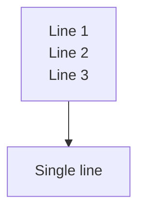
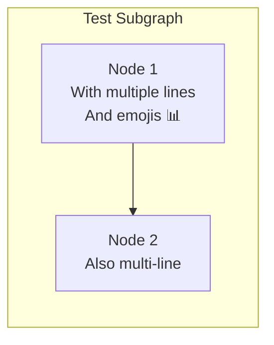
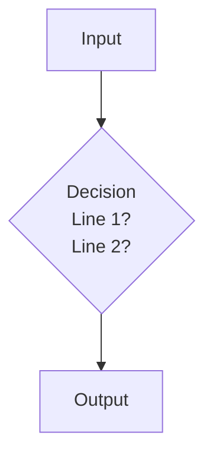

# Mermaid Syntax Test

This file tests a sample of the fixed syntax to ensure it renders correctly.

## Test 1: Multi-line node labels with quotes

## Test 2: Subgraph with quoted labels

## Test 3: Decision node with multi-line

